# Design Document

## Overview

Milestone 10.8 menambahkan control plane operasional native Windows di atas implementasi Milestone 10.1–10.7. Desain tidak mengubah domain trading. Ia mengatur bagaimana release, Windows Service Control Manager (SCM), process manager, readiness gate, Nginx, monitoring, backup/recovery, dan operator berinteraksi secara fail-closed.

Canonical deployment memakai **NSSM** untuk Backend Service dan Edge Service. PM2 adalah alternatif deployment yang mutually exclusive dan harus memenuhi kontrak ownership yang sama; satu host tidak boleh mencampur NSSM dan PM2 untuk process yang sama. Pemilihan canonical NSSM didasarkan pada kesesuaian dengan executable native Windows untuk Python/Uvicorn dan Nginx tanpa menambah runtime aplikasi lain.

Backend tetap satu process Uvicorn dengan tepat satu worker pada `127.0.0.1:8000`. Nginx tetap satu-satunya public entry point. Backend boleh ready ketika MT5 disconnected dan engine trading stopped. Readiness operasional baru dipisahkan dari static Nginx `/healthz` dan dari authenticated full-health yang menganggap MT5 disconnected sebagai degraded.

### Design Goals

- Lifecycle service deterministic, bounded, dan dapat diaudit.
- Cold boot memulai backend, membuktikan readiness/trading-safe state, lalu mempublikasikan Nginx.
- Crash/reboot/update/rollback tidak pernah resume MT5, Demo Execution, paper scheduler, atau broker mutation.
- Release backend dan Vite dist selalu dipromosikan/dirollback sebagai satu unit.
- Restore Milestone 10.7 selalu offline, manual, dan dilindungi Restore Hold.
- Monitoring membedakan host, edge liveness, backend readiness, recovery readiness, certificate, dan capacity.
- Seluruh operasi menghasilkan evidence tersanitasi tanpa secret.

### Non-Goals

- Tidak ada redesign Strategy, Risk, Backtest, Paper, Demo, Safety, MT5 connector, WebSocket, auth, atau recovery internals.
- Tidak ada Docker, Kubernetes, container, external queue, cloud deployment, active-active, multi-worker, atau database replacement.
- Tidak ada production deployment pada tahap design.

## Key Design Decisions

1. **NSSM canonical, PM2 alternative:** hanya satu model dipilih per host; seluruh semantics tetap sama.
2. **SCM owns processes; Operational Controller owns ordering:** controller one-shot memanggil SCM tetapi tidak menjadi process supervisor kedua.
3. **Distinct backend readiness contract:** backend-owned read-only probe membuktikan lease, database read, release identity, dan Trading-Safe State; `/healthz` tetap edge-only.
4. **Versioned immutable releases:** backend, per-release venv, Vite dist, dan release manifest dipromosikan sebagai satu set; mutable data/log/secret/recovery roots berada di luar release.
5. **Runtime lease is final backend-owner guard:** process manager count check adalah evidence, sedangkan kernel-backed database runtime lease adalah authority untuk single backend writer.
6. **MT5 connector is backend-owned:** Windows SCM tidak mengelola MT5 connector child atau terminal sebagai autostart service.
7. **Application rollback is not database restore:** incompatible schema menghentikan rollback; keputusan restore tetap manual melalui Milestone 10.7.
8. **Read-only monitoring:** monitoring tidak memiliki credential atau permission trading dan tidak menjalankan remediation destruktif.

## Architecture

### 1. Architecture Diagram

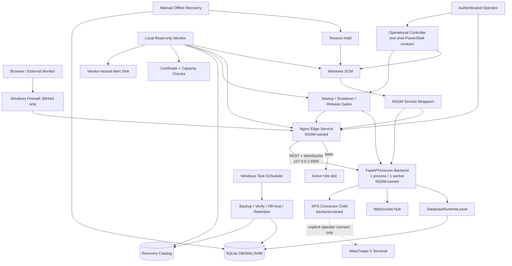

Control plane operasional tidak masuk ke broker data plane. Satu-satunya jalur menuju vendor MT5 tetap `Backend -> MT5 Connector Child -> Terminal`, dan connect/mutation hanya terjadi setelah action operator terautentikasi existing.

## 2. Service Topology

### Host layout konseptual

```text
Windows VPS
├── C:\apps\xauusd-trading-bot\releases\<release-id>\
│   ├── backend\
│   │   ├── app\
│   │   └── .venv\
│   ├── frontend\dist\
│   └── release-manifest.json
├── C:\apps\xauusd-trading-bot\current\   # active release reference
├── C:\ProgramData\XauUsdTradingBot\
│   ├── data\                 # SQLite DB/WAL/SHM
│   ├── logs\                 # backend operational logs
│   ├── evidence\             # sanitized operator evidence
│   ├── state\                # controller/restart/hold metadata
│   └── recovery\             # local catalog/work/forensic roots
├── C:\nginx\
│   ├── conf\
│   ├── conf\certs\
│   └── logs\
└── approved off-host filesystem destination
```

Path di atas adalah logical roles, bukan service configuration pada tahap design. Release content immutable; SQLite, logs, evidence, secrets, certificate, dan recovery state tidak berada di dalam release directory. Active release change hanya dilakukan saat service berada pada maintenance state.

### Long-running ownership

| Component              | Owner                                     | Startup                                     | Public               | Mutation capability                         |
| ---------------------- | ----------------------------------------- | ------------------------------------------- | -------------------- | ------------------------------------------- |
| Backend Uvicorn        | NSSM/SCM                                  | gated autostart                             | No, loopback only    | Domain APIs after auth                      |
| Nginx                  | NSSM/SCM                                  | after backend readiness                     | Yes, 80/443          | None against broker                         |
| MT5 connector child    | Backend parent                            | child infrastructure may start disconnected | No                   | Serialized vendor calls after explicit flow |
| MetaTrader terminal    | Connector/operator after explicit connect | Never service autostart                     | No                   | Demo account only through connector         |
| Backup pipeline        | Task Scheduler/recovery account           | scheduled                                   | No                   | Recovery catalog only                       |
| Restore                | Human operator/recovery account           | never scheduled                             | No                   | Offline DB replacement                      |
| Monitoring probes      | Task Scheduler/monitor identity           | scheduled                                   | Outbound alerts only | Read-only                                   |
| Operational Controller | Operator/startup task                     | one-shot                                    | No                   | SCM/release gates only                      |

## Components and Interfaces

### Operational Controller

A one-shot, fail-closed orchestration layer coordinates preflight, SCM actions, readiness polling, release activation, shutdown, reboot checks, rollback, Restore Hold, and evidence. It does not remain as a third process supervisor and never invokes trading endpoints.

Conceptual interfaces:

```text
Preflight(host, release) -> GateResult
StartBackend(release) -> ServiceResult
WaitBackendReady(deadline) -> ReadinessResult
ValidateEdge(release, certificate) -> GateResult
StartOrReloadEdge() -> ServiceResult
DrainAndStopEdge(deadline) -> ServiceResult
StopBackend(deadline) -> ServiceResult
ActivateRelease(candidate, previous) -> ActivationResult
EnterRestoreHold(change_id) / ReleaseRestoreHold(signoff)
WriteEvidence(event) -> SanitizedEvidence
```

### Backend readiness contract

A distinct read-only backend-owned readiness response is designed rather than reusing static `/healthz` or authenticated `/health/full`. It exposes only:

```text
status: READY | NOT_READY
service: fixed service identity
version: application version
release_id: non-secret release identity
checked_at: UTC timestamp
runtime_lease: ACQUIRED | UNAVAILABLE
database: READABLE | UNAVAILABLE
trading_safe: true | false
```

The route is rate-limited, bounded, non-mutating, and exposed externally only through an exact Nginx proxy location. It must not include MT5 account data, positions, database paths, hostnames, secrets, cookies, stack traces, or environment values. `MT5 disconnected` is compatible with `READY`; automatic MT5 initialization/connect is not part of the probe.

## 4. Startup Sequence

```mermaid
sequenceDiagram
    participant W as Windows/Startup Trigger
    participant C as Operational Controller
    participant S as SCM/NSSM
    participant B as Backend
    participant D as SQLite/Runtime Lease
    participant N as Nginx
    participant M as Monitoring

    W->>C: Start cold-boot gate
    C->>C: Validate account, release, config, ACL, capacity
    C->>S: Assert Nginx not published on cold start
    C->>S: Start Backend Service
    S->>B: Launch venv Python + Uvicorn --workers 1
    B->>D: Acquire DatabaseRuntimeLease
    B->>B: Initialize Demo/Paper STOPPED
    B->>B: Start internal non-trading infrastructure
    loop <= 120 seconds
        C->>B: Loopback readiness probe
        B-->>C: lease + DB + release + trading_safe
    end
    alt backend not ready
        C->>S: Stop failed backend / contain restart
        C->>M: Emit startup failure evidence + alert
    else backend ready
        C->>C: Validate Vite dist/release identity
        C->>N: Run Nginx config/certificate validation
        alt edge validation fails
            C->>M: Preserve previous edge; alert
        else edge validation passes
            C->>S: Start Nginx Service
            C->>N: Probe Edge Liveness
            C->>N: Probe backend readiness through proxy
            C->>C: Verify process/listener/trading-safe evidence
            C->>M: Publish successful startup evidence
        end
    end
```

Backend internal startup may create the existing MT5 connector child process, WebSocket hub, and backtest coordinator, but it does not call MT5 connect or enable Demo/Paper. Exactly one Uvicorn worker is both service argument policy and completion evidence.

## 5. Shutdown Sequence

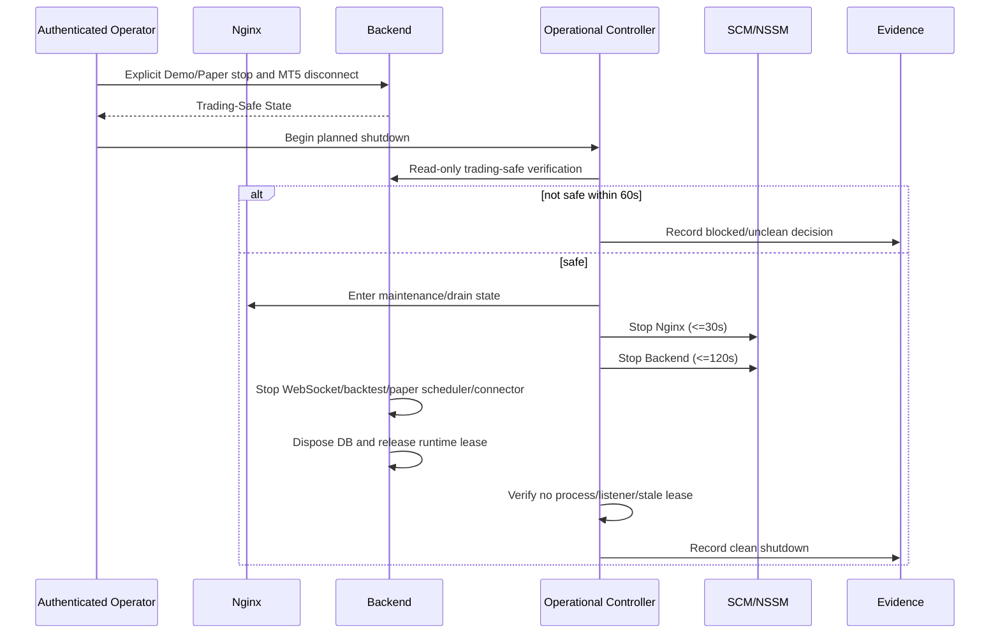

Shutdown does not call broker close/modify/cancel. Existing operator-controlled position management remains separate and cannot be inferred from service stop.

## 6. Restart Sequence

### Planned restart

Planned restart is `Shutdown Sequence -> Startup Sequence` under one change/evidence ID. It requires explicit Trading-Safe State before shutdown and never preserves operator mutation intent across the restart.

### Crash restart

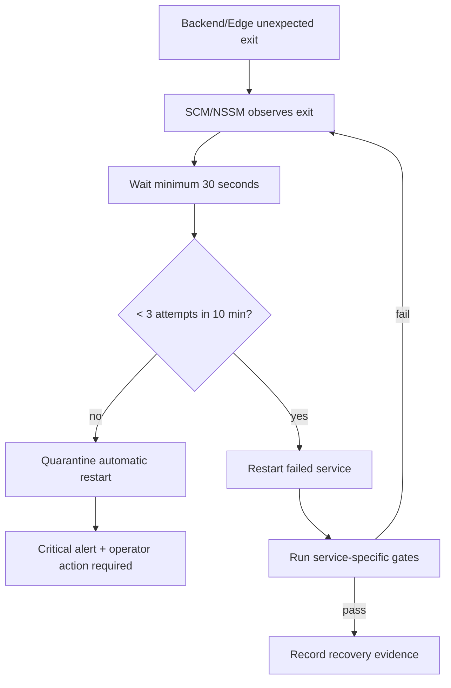

A backend crash always triggers full readiness and Trading-Safe verification. An edge crash validates Nginx configuration/certificate before restart. Backend is never exposed directly while edge is down.

## 7. Recovery Sequence

Service recovery is distinct from database Restore:

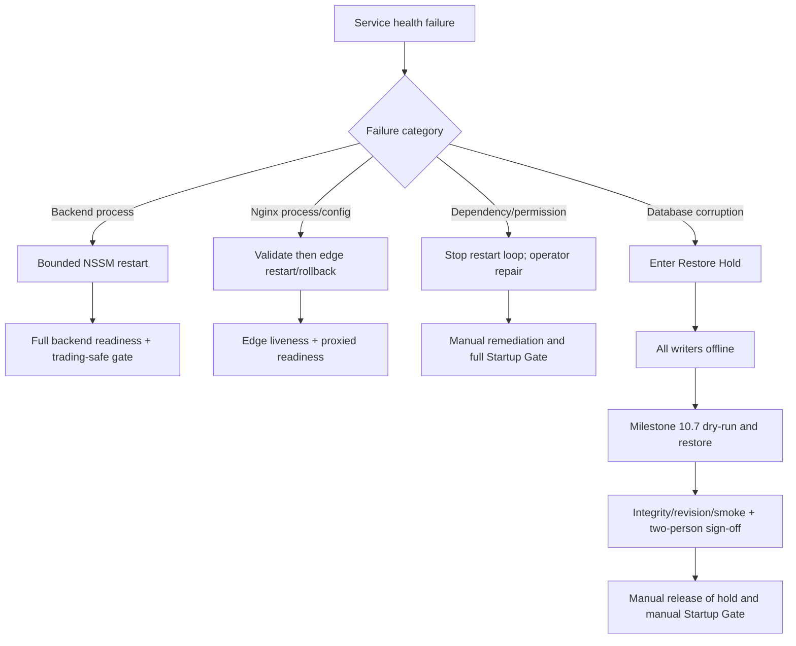

Automatic service recovery never migrates, restores, rolls back release, or deletes data. Database corruption transitions from service recovery into the manual Milestone 10.7 boundary.

## 8. NSSM or PM2 Service Architecture

### Canonical NSSM model

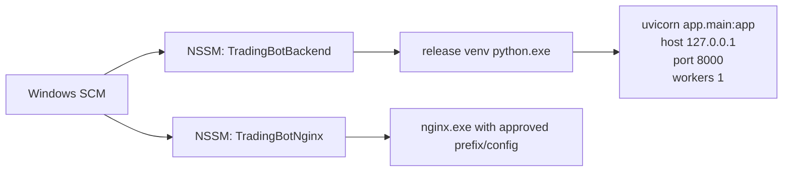

NSSM captures stdout/stderr to bounded backend logs, forwards stop to the child, applies graceful timeout, and records exit state. Windows service recovery is configured with bounded delay/attempt semantics; restart-loop policy remains authoritative in the Operational Controller/monitoring state.

SCM service state alone is not readiness. Nginx service dependency on Backend Service is a coarse ordering safety net; only Operational Controller readiness polling authorizes edge publication.

### PM2 alternative

PM2 may replace NSSM only through an explicit host decision. It must use fork mode, `instances=1`, no cluster, no watch/reload, explicit venv Python interpreter, bounded restart policy, Windows startup integration, and the same working directory/log/security constraints. Nginx must still have exactly one owner. PM2 and NSSM cannot supervise the same process.

| Decision factor                     | NSSM canonical                     | PM2 alternative                                      |
| ----------------------------------- | ---------------------------------- | ---------------------------------------------------- |
| Native Windows SCM integration      | Direct                             | Requires approved Windows integration                |
| Python and Nginx executable support | Direct                             | Supported as generic processes but adds Node runtime |
| Single-process enforcement          | Service definition + runtime lease | Fork/instances=1 + runtime lease                     |
| Operational complexity              | Lower                              | Higher                                               |
| Design status                       | Selected default                   | Allowed only after equivalent contract review        |

No implementation shall install both merely for fallback. Fallback is release/service-definition rollback, not dual supervision.

## 9. Nginx Reverse Proxy Flow

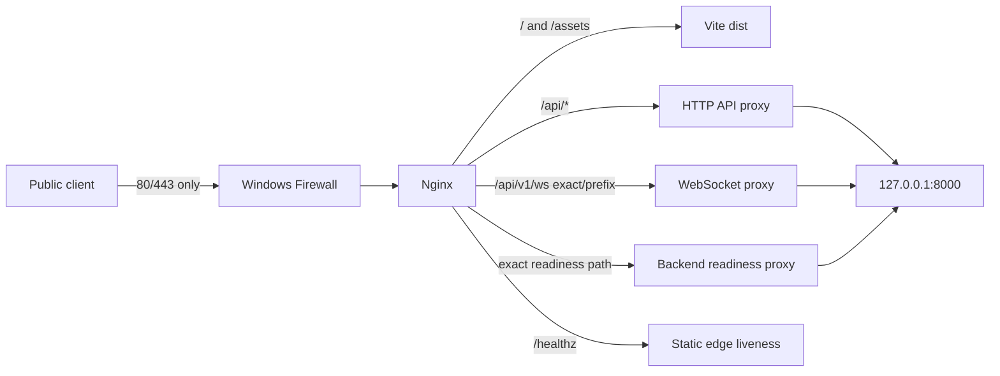

Existing TLS, limits, forwarded-header overwrite, security headers, caching, upload bound, WebSocket upgrade, and docs denial remain unchanged. The new readiness path is exact-match, read-only, rate-limited, no-store, and minimal. `/nginx/status` remains loopback-only. Firewall evidence must show no public listener for Uvicorn.

During cold start, Nginx is not newly published until backend gate succeeds. During an already-running edge/backend crash, Nginx may remain available and return upstream failure; monitoring reports edge up/backend down rather than treating `/healthz` as application readiness.

## 10. Backend Process Ownership

The ownership invariant is:

```text
SCM -> selected process manager -> one Uvicorn parent/process -> app lifespan
```

- Process Manager owns start/stop/restart of Uvicorn.
- Uvicorn owns one FastAPI lifespan.
- FastAPI lifespan owns `DatabaseRuntimeLease`, WebSocket hub, backtest coordinator, paper shutdown registration, MT5 manager disconnect, and other existing resources.
- Kernel runtime lease prevents a second file-backed backend from becoming active even if process-count checks race.
- Task Scheduler, monitoring, operator shells, and recovery tooling never launch a second backend directly.
- Release identity is injected/read from non-secret release metadata and included in readiness/evidence.

## 11. MT5 Process Ownership

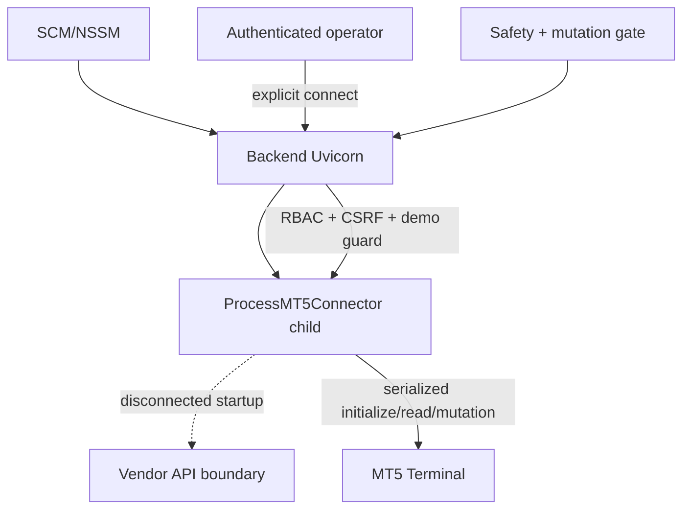

SCM does not manage the connector child or terminal as separate services. Connector child lifetime is subordinate to backend lifetime and is stopped during backend shutdown. Merely starting the child does not authorize `initialize/connect` or any order. Terminal startup/attachment can only occur within the explicit connect flow already protected by auth, demo verification, connector isolation, and Safety Layer.

After reboot/crash/update/rollback:

- manager status starts disconnected;
- no operator action is replayed;
- Demo Execution initializes stopped;
- paper scheduler initializes stopped;
- timeout/UNKNOWN reconciliation gates remain authoritative;
- monitoring never carries MT5-control permission.

## 12. Monitoring Flow

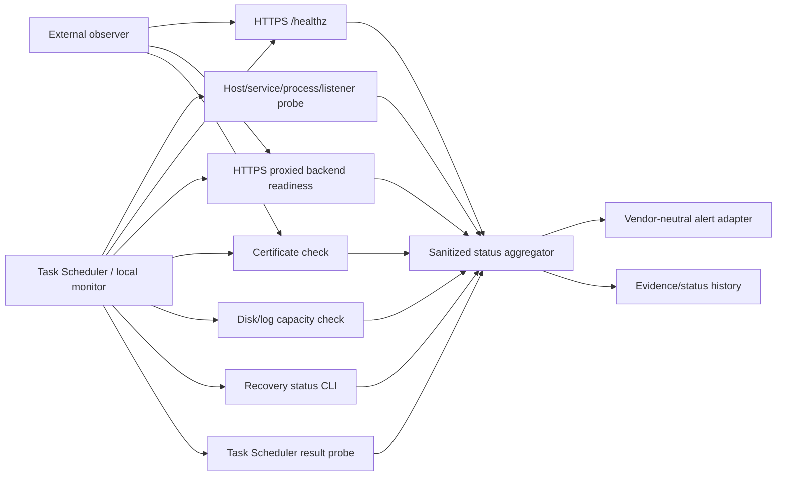

Probe state is keyed by category and target. Three consecutive failures within 60-second cadence produce an alert within five minutes. Backup status remains on a 15-minute watchdog cadence. Alert delivery has its own heartbeat so a silent notification channel is distinguishable from a healthy system.

No monitor performs service remediation beyond generating bounded status/alert. Automatic restart remains SCM/NSSM responsibility; update, rollback, retention deletion, restore, and trading controls remain human/gated operations.

### Status separation

| Signal                   | Meaning                                    |         MT5 required? |
| ------------------------ | ------------------------------------------ | --------------------: |
| Host availability        | Windows reachable                          |                    No |
| Edge liveness `/healthz` | Nginx can answer static request            |                    No |
| Backend readiness        | Lease + DB read + app + trading-safe state |                    No |
| Full application health  | Authenticated operational/domain detail    | May show degraded MT5 |
| Recovery readiness       | Valid/off-host backup, RPO, drill          |                    No |

## 13. Logging Flow

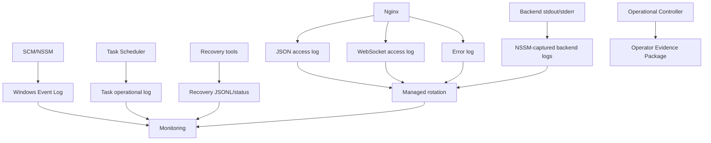

Logs use UTC timestamps, correlation/change ID where applicable, bounded fields, and explicit event category. Nginx keeps current split-log design. Backend service output excludes environment dumps and secrets. Recovery JSONL remains under Milestone 10.7 ownership. Evidence references logs by event ID/time range rather than copying unrestricted raw logs.

Rotation touches only allowlisted owned files, never active SQLite/WAL/SHM, backup, forensic, certificate, key, or unknown files. Rotation success, age, size, and quota become monitoring inputs.

## 14. Backup and Restore Integration

### Online backup

The scheduled pipeline remains `backup -> verify -> off-host copy -> retention`. It may read the active SQLite database through Online Backup API while backend runs. It is not an SCM dependency and does not stop/start services. Update preflight consumes only sanitized recovery status and requires `AVAILABLE`, `rpo_met=true`, plus off-host verification when migration is planned.

### Restore integration

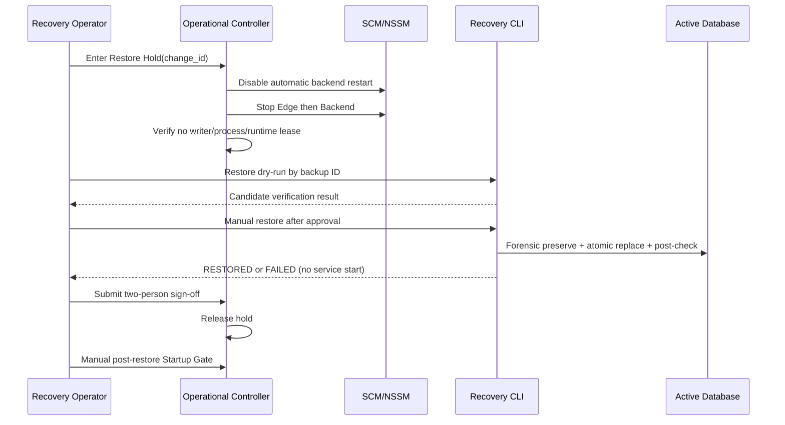

Restore Hold is durable across controller restart and defaults to held when its state is ambiguous. Recovery tooling never gains authority to call SCM. A successful restore does not imply application-release compatibility; manual Startup Gate validates release/schema compatibility before publication.

## 15. Windows Service Dependency Order

Logical dependency order:

```text
Windows kernel/network/time/filesystem
  -> service accounts + ACL + protected configuration
  -> release identity + SQLite/recovery preflight
  -> Backend Service (NSSM)
  -> DatabaseRuntimeLease + backend readiness
  -> Vite/Nginx/certificate validation
  -> Edge Service (NSSM)
  -> proxied readiness + edge liveness
  -> monitoring success state
```

SCM `DependOnService` expresses only coarse `Edge -> Backend` dependency. It is not sufficient for readiness. The Operational Controller performs the semantic gate. Stop order is exact reverse: Edge drain/stop, Backend graceful stop, then maintenance/reboot. Monitoring and backup tasks depend on host availability but are not parents of application services.

## 16. Certificate Renewal Flow

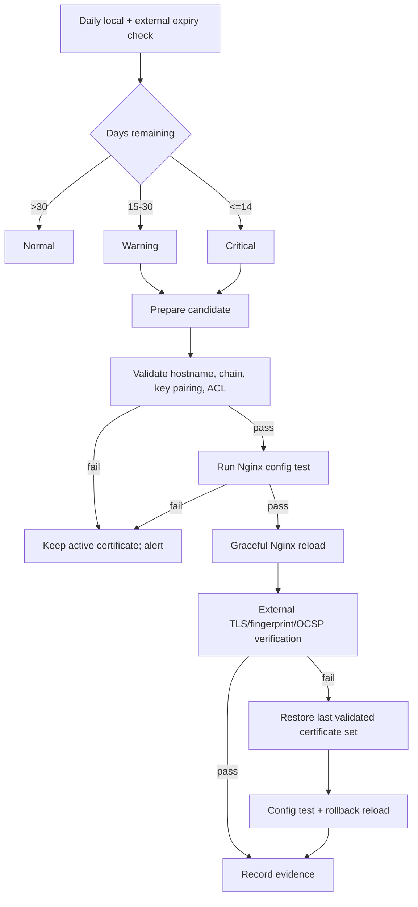

Certificate files remain outside release and repository. Renewal never restarts backend or changes trading state. Private-key content never enters logs/evidence; only approved non-secret fingerprint and expiry are recorded.

## 17. Windows Update and Reboot Flow

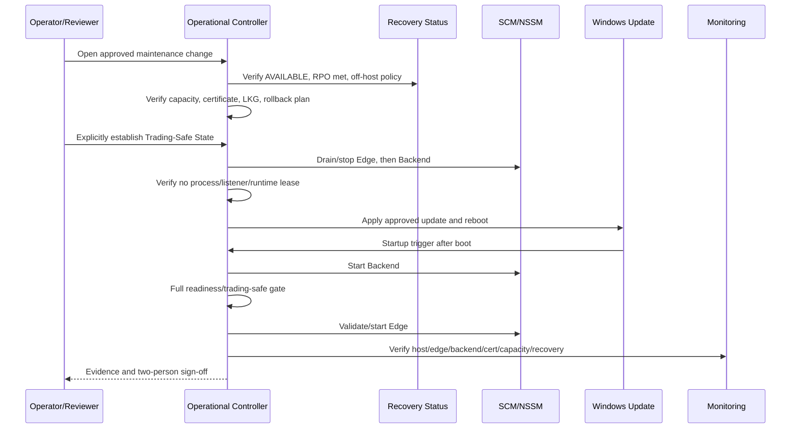

Windows Update is never allowed to infer clean trading state merely because a process exited. If graceful shutdown cannot be proven, the event is marked unclean and the post-boot gate remains mandatory. MT5 and trading engines stay stopped after reboot.

## 18. Rollback Flow

Application rollback treats a release as an immutable tuple:

```text
ReleaseSet = backend source + per-release venv + frontend dist
           + Nginx application config/snippets + service manifest
           + release identity + expected Alembic compatibility
```

Mutable DB, secrets, certificate, logs, evidence, and recovery catalog are not overwritten by release rollback.

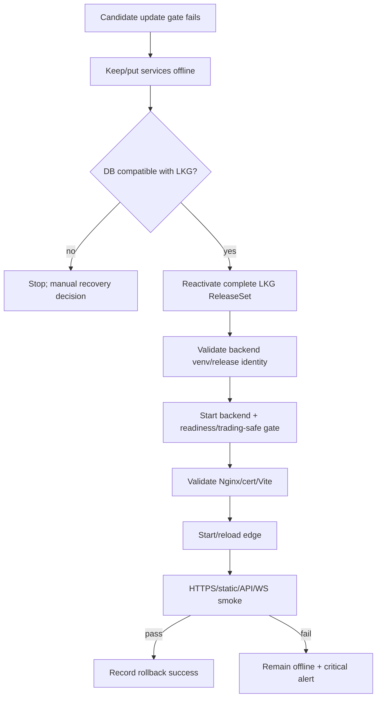

No automatic Alembic downgrade or database restore is performed. If candidate migration is forward-only and prevents LKG compatibility, the service remains offline until an explicit operator recovery decision.

## 19. Disaster Recovery Flow

Disaster recovery addresses loss of the original host or active database, not ordinary process crashes:

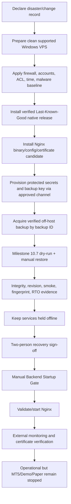

DNS/public cutover occurs only after proxied readiness, TLS, release identity, recovery status, process/listener, and Trading-Safe State evidence pass. Broker state reconciliation, if later required, remains an explicit authenticated MT5 workflow and is not part of host recovery automation.

## 20. Security Model

### Identity separation

| Identity           | Allowed                                                           | Explicitly denied                                 |
| ------------------ | ----------------------------------------------------------------- | ------------------------------------------------- |
| Backend service    | Read release/config; modify backend data/logs; loopback listen    | Admin, interactive login, service reconfiguration |
| Nginx service      | Read dist/config/certificate; modify Nginx logs; public 80/443    | DB/recovery access, backend port ownership        |
| Recovery account   | Recovery roots, source DB read for backup, offline restore rights | Automatic service start, trading permissions      |
| Monitoring account | Read service/status/log metadata and readiness                    | Trading mutation, rollback, restore, config write |
| Release operator   | Approved service/release workflow                                 | Secret export, direct broker bypass               |
| Reviewer/auditor   | Evidence read/sign-off                                            | Service or trading mutation by default            |

### Trust boundaries

1. **Internet -> Nginx:** TLS, Host validation, limits, security headers.
2. **Nginx -> backend loopback:** overwritten forwarding headers and explicit trusted proxy configuration.
3. **Backend -> MT5 connector:** serialized process boundary with deadlines and mutation quarantine.
4. **Backend -> SQLite:** single runtime lease and async DB access.
5. **Recovery -> filesystem:** separate account, operation lease, managed paths, offline restore.
6. **Monitoring -> alert sink:** allowlisted sanitized payload, outbound-only where possible.
7. **Operator -> control plane:** named account, approved maintenance/change record, least privilege, reviewer separation.

Secrets remain outside repository/release/evidence and are supplied through protected Windows runtime sources. Absence is represented as a category, never by echoing a value. MT5 credential absence keeps MT5 disconnected; backup-key absence blocks recovery operations but does not make safe backend startup depend on the key.

### Network model

- Public inbound: HTTP/HTTPS to Nginx only.
- Backend: loopback `127.0.0.1:8000` only.
- Nginx status: loopback only.
- SQLite, service control, recovery roots, monitoring internals: no public listener.
- Administrative access: approved source networks and named accounts.
- External alert/certificate checks: outbound or external observer, vendor-neutral.

## Data Models

### Operational Metadata Models

These are design contracts, not database tables. They use atomic sidecar/evidence records outside Active SQLite so status remains available during DB incidents.

### ReleaseManifest

```text
schema_version
release_id
application_version
source_revision
alembic_compatible_revision
frontend_build_id
backend_hash / frontend_hash / nginx_config_hash
created_at_utc
status: CANDIDATE | ACTIVE | LAST_KNOWN_GOOD | REJECTED
```

No secret, raw environment, credential, or private key is included.

### RestoreHoldRecord

```text
schema_version
change_id
created_at_utc
state: HELD | RELEASE_APPROVED
reason_category
operator_id_hash
reviewer_id_hash | null
restore_id | null
```

Ambiguous, unreadable, or partial hold state is interpreted as `HELD`.

### ServiceGateResult

```text
operation_id
release_id
started_at_utc / completed_at_utc
preflight / backend_start / readiness / edge_validation / edge_start
process_count / listener_state / runtime_lease_state
trading_safe / broker_mutation_count
status: PASS | FAIL
failure_category | null
```

### OperatorEvidencePackage

```text
event_id / event_type / change_id
host_identity_hash
release_from / release_to
operator_id_hash / reviewer_id_hash
timing and bounded gate results
service/process/listener/readiness states
certificate/capacity/recovery/monitoring summaries
migration and rollback outcomes
zero-trading counters
final_decision
```

Evidence is immutable after sign-off, ACL-restricted, retained at least 180 days, and contains only allowlisted fields.

## Error Handling

### Failure Modes

| Failure                                | Detection                    | Required outcome                                  |
| -------------------------------------- | ---------------------------- | ------------------------------------------------- |
| Missing/invalid release                | Preflight/hash/manifest      | Do not start candidate                            |
| More than one backend process          | Process count/runtime lease  | Second process fails; gate fails                  |
| Runtime lease unavailable              | Backend startup/readiness    | Not ready; contain restart                        |
| Database unreadable/locked             | Readiness DB probe           | Backend not ready; edge not newly published       |
| MT5 disconnected                       | Trading-safe/readiness       | Backend may remain ready                          |
| Persisted Demo/Paper running           | Startup state initialization | Force stopped without mutation                    |
| Backend startup timeout                | 120-second gate              | Stop/alert; no cold edge publication              |
| Nginx config invalid                   | `nginx -t` equivalent gate   | Never reload/start candidate config               |
| Edge up/backend down                   | Split probes                 | Edge alive, backend critical alert                |
| Edge down/backend up                   | Split probes/firewall        | Backend remains private; edge alert               |
| Backend/edge crash loop                | Attempt-window state         | Stop after 3/10 min; manual action                |
| Graceful stop timeout                  | SCM/controller deadline      | Mark unclean; force stop; full next gate          |
| Release identity mismatch              | Release manifest/smoke       | Reject publication                                |
| Migration failure                      | Offline update gate          | Keep backend offline; no downgrade                |
| LKG schema incompatible                | Rollback compatibility gate  | Stop rollback; manual recovery decision           |
| Restore attempted while backend active | Restore Hold/runtime lease   | Reject restore                                    |
| Restore success/failure                | Recovery result              | Keep services stopped until sign-off              |
| Certificate candidate invalid          | Chain/key/config validation  | Preserve active certificate                       |
| Certificate post-reload failure        | External probe               | Roll back certificate set                         |
| Disk warning/critical                  | Capacity monitor             | Alert; block update at critical; no ad-hoc delete |
| Log rotation failure/quota             | Rotation monitor             | Alert; only managed remediation                   |
| Backup stale/off-host failed           | Recovery status              | Alert; block migration/update gate as applicable  |
| Monitoring delivery silent             | Delivery heartbeat           | Integration-unavailable alert/status              |
| Secret in output/evidence              | Redaction scanner            | Security gate fails; quarantine evidence          |
| Windows Update forced reboot           | Unclean marker               | Full startup gate; trading remains stopped        |
| Host loss                              | External monitor             | Manual disaster recovery flow                     |

## Correctness Properties

### Property 1: Single owner

At most one file-backed backend can hold the runtime lease and become ready.

**Validates: Requirements 2.1, 2.8, 3.4**

### Property 2: Edge publication

A cold candidate edge is published only after backend readiness and edge validation pass.

**Validates: Requirements 3.2, 3.7, 3.8, 3.12**

### Property 3: Trading-safe lifecycle

Every lifecycle-only transition produces zero MT5 connect, engine start, and broker mutation calls.

**Validates: Requirements 4.1, 4.2, 4.3, 4.4, 4.5, 4.6, 4.7, 4.8, 15.8**

### Property 4: Readiness separation

Edge liveness success cannot imply backend readiness success.

**Validates: Requirements 3.11, 9.4, 9.5**

### Property 5: Bounded restart

Any repeated crash reaches quarantine after at most three attempts in ten minutes.

**Validates: Requirements 6.1, 6.2, 6.3**

### Property 6: Release atomicity

Backend and frontend identities cannot be mixed in an active release.

**Validates: Requirements 7.8, 7.12**

### Property 7: Rollback isolation

Application rollback never modifies Active SQLite or invokes restore/downgrade automatically.

**Validates: Requirements 7.7, 7.14**

### Property 8: Restore hold

While hold exists or is ambiguous, backend automatic start is impossible.

**Validates: Requirements 8.3, 8.6, 8.7, 8.8, 8.9**

### Property 9: Secret non-interference

Changing a secret value cannot change serialized logs/evidence except sanitized availability state.

**Validates: Requirements 13.7, 13.8, 13.9, 13.10, 13.11, 13.12, 13.13, 13.14**

### Property 10: Private backend

Edge failure never makes Uvicorn publicly reachable.

**Validates: Requirements 2.2, 2.3, 12.4, 12.5**

### Property 11: Evidence determinism

Identical gate observations produce the same pass/fail decision independent of enumeration order.

**Validates: Requirements 14.7, 14.8, 14.9, 14.10, 14.11, 14.12, 16.2**

### Property 12: Managed deletion

Capacity/rotation workflows never delete unowned data, DB/WAL/SHM, backup, forensic, certificate, or secret files.

**Validates: Requirements 11.8, 11.12, 11.13**

## Testing Strategy

No production VPS, production database, real credential, or real broker operation is used. Tests combine pure policy tests, contract tests over generated service definitions, fake SCM/process adapters, temporary file-backed SQLite, local loopback processes, and existing Nginx sandbox validation.

### Test layers

- **Policy/unit:** gate state machines, restart windows, thresholds, compatibility, redaction, evidence schemas.
- **PowerShell contract:** strict mode, bounded arguments, no secret argv, exact exit propagation, no trading endpoint calls.
- **Process-manager contract:** NSSM canonical definitions and PM2 alternative constraints without installing production services.
- **Loopback integration:** one temporary Uvicorn process, second-process lease rejection, readiness, graceful stop, and listener checks.
- **Nginx sandbox:** static edge liveness versus proxied readiness, API/WebSocket flow, failed config/certificate candidate.
- **Lifecycle simulation:** cold boot, shutdown, forced exit, restart-loop, update, rollback, Restore Hold, post-restore start.
- **Monitoring simulation:** check cadence, split alerts, certificate dates, capacity thresholds, recovery status, delivery heartbeat.
- **Security tests:** ACL/identity contract, listener inventory, secret canaries, evidence allowlist, prohibited-tool scan.
- **Regression:** all existing backend/frontend/Nginx/WebSocket/auth/MT5/Safety/recovery suites with real MT5 integration deselected.

### Required lifecycle matrix

| Scenario               | Backend             | Edge                     | Trading state        | Expected            |
| ---------------------- | ------------------- | ------------------------ | -------------------- | ------------------- |
| Clean cold boot        | starts first        | starts after ready       | stopped/disconnected | PASS                |
| Backend readiness fail | stopped/quarantined | not newly published      | stopped/disconnected | FAIL + alert        |
| Edge validation fail   | ready/private       | previous edge or stopped | stopped/disconnected | FAIL + alert        |
| Backend crash          | bounded restart     | may remain alive         | reset safe           | split status        |
| Edge crash             | remains private     | validated restart        | unchanged safe       | split status        |
| Planned reboot         | graceful stop/start | reverse stop/start       | stopped/disconnected | PASS                |
| Forced reboot          | full gate           | after backend ready      | stopped/disconnected | unclean evidence    |
| Update success         | candidate ready     | candidate published      | stopped/disconnected | PASS                |
| Update failure         | offline/rollback    | not candidate            | stopped/disconnected | rollback/hold       |
| Restore                | stopped/held        | maintenance/offline      | stopped/disconnected | manual only         |
| Post-restore           | manual start        | after ready              | stopped/disconnected | PASS after sign-off |

Every lifecycle case records call guards for MT5 connect, Demo start, paper start, `order_check`, `order_send`, close, modify, and cancel; all must remain zero.

## Requirements Traceability

| Design area                 | Requirements   |
| --------------------------- | -------------- |
| Architecture/topology/NSSM  | 1, 2, 12, 13   |
| Startup/readiness/ownership | 3, 4, 15       |
| Shutdown/restart/recovery   | 5, 6, 8, 15    |
| Nginx and process ownership | 2, 3, 4, 12    |
| Monitoring/logging          | 9, 11, 13, 14  |
| Backup/restore integration  | 7, 8, 11       |
| Certificate renewal         | 10, 14         |
| Windows Update/rollback     | 5, 7, 12, 14   |
| Disaster recovery           | 8, 11, 13, 14  |
| Security/evidence           | 12, 13, 14, 16 |
| Failure modes/testing       | 15, 16         |

## Database and Deployment Impact

- No database migration is required by the design itself.
- Active SQLite schema and all trading records remain unchanged.
- Operational release/hold/evidence metadata is filesystem sidecar state, separate from Active SQLite.
- Implementation may add a minimal read-only readiness contract and native operational tooling, but shall not alter trading APIs or recovery semantics.
- Production service definitions and Task Scheduler configuration are generated/applied only in a later implementation/deployment stage with explicit operator approval.
- Exactly one Uvicorn worker, loopback binding, Vite dist, native Nginx, and NSSM canonical process management remain mandatory.

## Design Constraints and Decision Log

1. NSSM is canonical; PM2 is not a simultaneous fallback.
2. Windows SCM dependency is insufficient for application readiness; semantic ordering belongs to the one-shot Operational Controller.
3. Existing `/api/v1/health` is liveness-only and `/api/v1/health/full` couples domain health to MT5 state; neither is authoritative operational readiness, so a distinct minimal readiness contract is designed.
4. Existing `DatabaseRuntimeLease` is reused as ownership authority rather than inventing another database lock.
5. Existing demo initialization and paper state reset are preserved as Trading-Safe foundations.
6. Existing connector child isolation is preserved; SCM never owns vendor calls.
7. Static `/healthz` remains intentionally simple and cannot satisfy backend gates.
8. Release rollback and database restore remain separate to prevent accidental data loss.
9. Monitoring is detection-only; remediation stays with bounded service policy or explicit operator workflows.
10. No Tasks or implementation artifacts are part of this Design stage.
