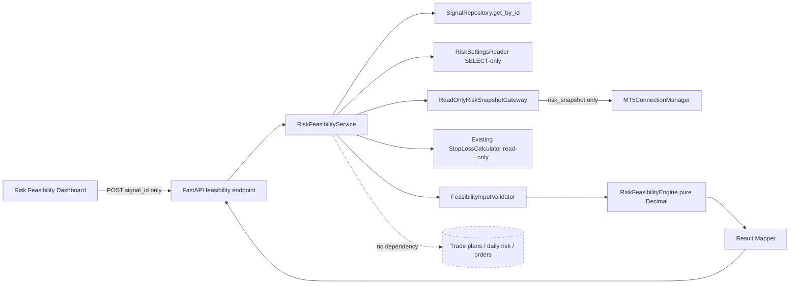
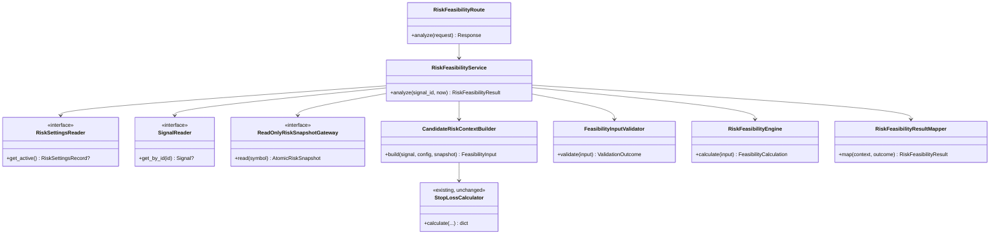
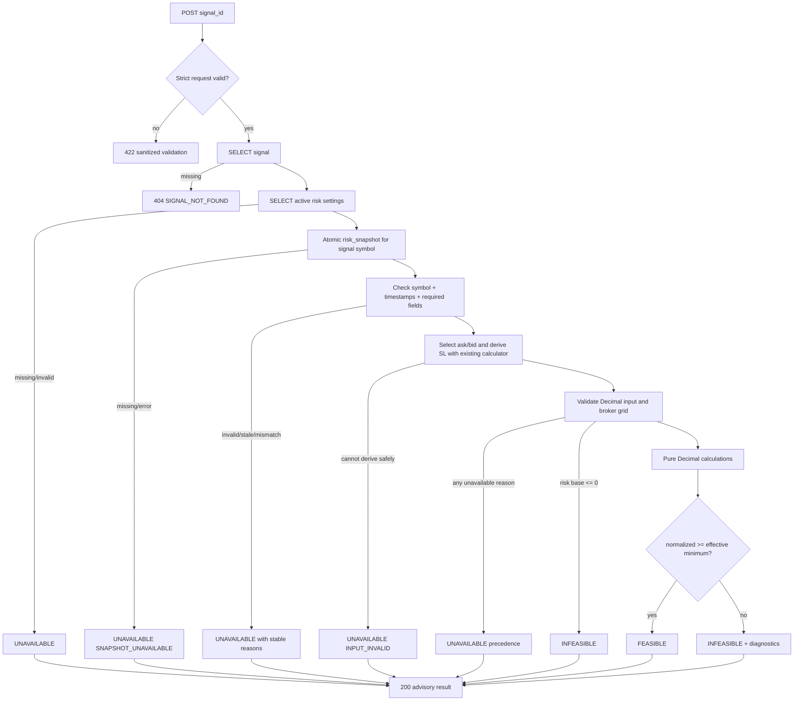
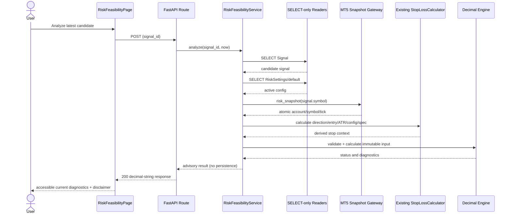
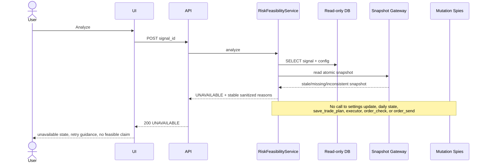

# Design Document: Risk Feasibility Analyzer

## Overview

Risk Feasibility Analyzer adalah jalur analisis advisory yang berdiri terpisah dari pembuatan Trade Plan. Jalur ini membaca candidate signal, konfigurasi risk aktif, serta snapshot account/symbol/tick MT5 yang sama jenisnya dengan input flow existing; kemudian menghitung apakah formula position sizing dapat menghasilkan volume pada grid broker. Hasil dikembalikan langsung ke dashboard dan tidak dipersist.

Tujuan desain:

- Memberikan status deterministik `FEASIBLE`, `INFEASIBLE`, atau `UNAVAILABLE` beserta diagnosis kuantitatif.
- Menjaga `TradePlanService.create_trade_plan`, `PositionSizeCalculator`, Strategy Engine, Risk Management, executor, paper/demo/backtest, dan seluruh record existing tetap tidak berubah.
- Menjamin jalur analyzer hanya memiliki dependency baca; tidak ada repository method mutasi atau broker trading method yang dapat dijangkau.
- Mempertahankan nilai keputusan sebagai string desimal pada API agar boundary volume-step tidak berubah akibat serialisasi binary float.
- Berjalan in-process pada FastAPI dan React/Vite existing dalam deployment native VPS; tidak ada container, daemon, queue, database, atau service baru.

### Findings yang Mendasari Desain

1. `MT5ConnectionManager.risk_snapshot(symbol)` sudah mengambil account, symbol specification, dan tick di bawah satu lock serta tidak memanggil `order_check`/`order_send`. Ini menjadi satu-satunya gateway broker analyzer.
2. `RiskRepository.get_or_create_settings()` dapat menulis default. Analyzer tidak boleh memakainya; desain menambahkan reader SELECT-only yang mengembalikan unavailable ketika row `RiskSettings/default` tidak ada.
3. Signal tersimpan memiliki `symbol`, `direction`, `atr`, status, dan timestamp, tetapi tidak menyimpan stop-loss. Candidate context therefore memakai `StopLossCalculator.calculate()` existing secara read-only dengan ATR signal, konfigurasi aktif, entry quote, dan specification yang sama seperti flow creation. Tidak ada source/interface/behavior calculator yang diubah.
4. `PositionSizeCalculator` mengembalikan float dan melempar error sebelum diagnostic infeasible dapat dijelaskan. Analyzer memakai engine Decimal murni yang menyalin formula decision-boundary existing dan diuji secara differential terhadap calculator; calculator existing tidak dipanggil atau diubah.
5. Freshness existing pada readiness broker adalah maksimum 60 detik. Analyzer menggunakan policy backend existing tersebut terhadap timestamp tick dan tidak menambah environment variable.
6. Frontend memakai React Query, lazy route, status badge, panel, dan sanitasi error existing. Dashboard analyzer mengikuti pola tersebut tanpa menghubungkan hasilnya ke enabled/disabled state tombol pembuatan plan.

### Non-goals dan Safety Boundary

Analyzer bukan approval gate, bukan rekomendasi trading, dan bukan simulator eksekusi. Tidak ada call graph dari analyzer menuju `save_trade_plan`, daily risk state, update settings, Strategy Engine, paper/demo/backtest services, Safety mutation, `check_market_order`, `execute_market_order`, `order_check`, atau `order_send`. Diagnostic minimum lot tidak pernah menjadi input aksi lain. Tidak ada perubahan `.env`, konfigurasi produksi, topology, schema, migration, atau backfill.

## Architecture

Desain menggunakan vertical slice baru di dalam proses backend existing: strict HTTP contract → orchestration service read-only → source adapters read-only → pure Decimal engine → response mapper. Frontend menambahkan halaman dashboard terpisah. Batas dependency dibuat eksplisit agar analyzer tidak dapat mengakses API mutasi.



### Layer dan Dependency Rules

| Layer         | Tanggung jawab                                                | Dependency yang diizinkan                                         | Dependency terlarang                           |
| ------------- | ------------------------------------------------------------- | ----------------------------------------------------------------- | ---------------------------------------------- |
| API           | Validasi body strict, mapping HTTP, response schema           | `RiskFeasibilityService`                                          | Trade-plan creation dan executor               |
| Orchestration | Membaca context, membangun input immutable, precedence status | Read-only readers, snapshot gateway, stop calculator, pure engine | Repository mutation dan risk-state manager     |
| Domain        | Validasi finite/geometry/grid dan formula Decimal             | Python `Decimal`                                                  | DB, MT5 client, clock global, float arithmetic |
| Presentation  | Request, stale-result guard, accessible diagnostics           | API client dan React Query                                        | Risk settings update dan create-plan mutation  |

### Deployment Architecture

Fitur tetap berada pada unit deployment existing:

- Backend: modul Python baru dimuat oleh FastAPI/Uvicorn dari virtual environment VPS yang sama.
- Frontend: halaman React ikut output `frontend/dist` dari Vite dan dilayani Nginx existing.
- Nginx: memakai reverse proxy `/api/v1` existing; tidak diperlukan location, port, WebSocket, atau upstream baru.
- Process manager: lifecycle tetap NSSM pada Windows VPS atau PM2 bila itulah process manager existing.
- Rollback: deploy kembali artefak backend/frontend sebelumnya; tidak ada migration atau data rollback.

## Components and Interfaces

### Backend Components

#### `RiskFeasibilityService`

Orchestrator stateless dengan method:

```text
analyze(signal_id: str, now: datetime) -> RiskFeasibilityResult
```

Urutannya: baca signal; tolak not-found; baca settings tanpa create; ambil satu atomic risk snapshot untuk symbol signal; validasi symbol/timestamps; pilih ask untuk BUY atau bid untuk SELL; derive stop melalui `StopLossCalculator` existing; bentuk `FeasibilityInput`; jalankan validator dan engine; susun reasons/recommendation/unit metadata. Service tidak menerima overrides.

#### `RiskSettingsReader`

Interface minimal:

```text
get_active() -> RiskSettingsRecord | None
```

Implementasi hanya menjalankan `SELECT/session.get(RiskSettings, "default")`. Tidak memanggil `get_or_create_settings`, `update_settings`, `commit`, atau `flush`. Row tidak ada menghasilkan `UNAVAILABLE/INPUT_INVALID` dengan pesan sanitized bahwa konfigurasi aktif tidak tersedia.

#### `ReadOnlyRiskSnapshotGateway`

Interface capability-limited:

```text
read(symbol: str) -> AtomicRiskSnapshot
```

Adapter hanya mendelegasikan ke `MT5ConnectionManager.risk_snapshot(symbol)`. Interface sengaja tidak mengekspos method trading. Adapter menambahkan `captured_at` dari injected UTC clock setelah read, mengonversi tick `time_msc` (fallback `time`) menjadi `tick_at`, dan menetapkan `account_snapshot_at` serta `symbol_snapshot_at` ke `captured_at` karena ketiganya dibaca dalam critical section yang sama. Tick stale jika age > 60 detik, timestamp hilang/masa depan tidak masuk akal, atau policy backend existing menyatakan stale.

#### `CandidateRiskContextBuilder`

Memastikan signal berstatus `CANDIDATE`, direction BUY/SELL, dan symbol signal sama persis dengan resolved snapshot symbol. Entry adalah ask untuk BUY dan bid untuk SELL. Stop loss dihitung memakai instance `StopLossCalculator` existing dengan `signal.atr`, config aktif, dan symbol specification snapshot. Ini mereproduksi candidate context Trade Plan tanpa membuat plan, target, risk lock, atau record. Kegagalan derivasi menghasilkan `UNAVAILABLE`, bukan rejected Trade Plan.

#### `FeasibilityInputValidator`

Validator pure yang mengonversi semua numeric menggunakan pola `Decimal(str(value))`, menolak bool/non-finite, menerapkan positivity, direction, stop geometry, symbol consistency, freshness, dan broker-grid checks. Semua error validation dikumpulkan sebagai reason code unik dalam urutan stabil; keberadaan satu error unavailable mengalahkan infeasible.

#### `RiskFeasibilityEngine`

Pure function/class tanpa I/O:

```text
calculate(input: ValidFeasibilityInput) -> FeasibilityCalculation
```

Engine menggunakan context Decimal runtime existing dan formula:

```text
risk_amount = risk_base * risk_percent / 100
stop_distance = abs(entry_price - stop_loss_price)
ticks_at_risk = stop_distance / trade_tick_size
risk_per_lot = ticks_at_risk * trade_tick_value
raw_lot = risk_amount / risk_per_lot
capped_lot = min(raw_lot, volume_max)
normalized_lot = floor(capped_lot / volume_step) * volume_step
minimum_broker_lot = ceil(volume_min / volume_step) * volume_step
required_minimum_risk_base = minimum_broker_lot * risk_per_lot * 100 / risk_percent
maximum_stop_distance = risk_amount * trade_tick_size / (minimum_broker_lot * trade_tick_value)
boundary_stop_loss = entry_price - maximum_stop_distance  # BUY
boundary_stop_loss = entry_price + maximum_stop_distance  # SELL
minimum_lot_estimated_risk_amount = minimum_broker_lot * ticks_at_risk * trade_tick_value
minimum_lot_estimated_risk_percent = minimum_lot_estimated_risk_amount / risk_base * 100
```

Engine tidak clamp-up. Jika `risk_base <= 0`, status adalah `INFEASIBLE/RISK_BASE_NOT_POSITIVE`; diagnostic yang membagi risk base menjadi null. Jika minimum broker lot melebihi volume max, status `UNAVAILABLE/BROKER_VOLUME_GRID_INVALID`. Reason infeasible disusun menurut order konstanta: `RISK_BASE_NOT_POSITIVE`, `NORMALIZED_LOT_BELOW_BROKER_MINIMUM`, lalu `STOP_DISTANCE_EXCEEDS_FEASIBLE_MAXIMUM`.

#### `RiskFeasibilityResultMapper`

Mapper mengubah setiap Decimal menjadi canonical plain decimal string (bukan exponent dan bukan JSON number), mempertahankan nol signifikan hanya bila berguna untuk unit. Nilai unavailable adalah JSON `null`, bukan `"0"`. Mapper menambahkan unit metadata, disclaimer advisory, timestamp, stable reasons, dan recommendation tanpa account login atau exception mentah.

### Frontend Components

- `RiskFeasibilityPage`: lazy route `/risk-feasibility`, pemilih context latest candidate yang read-only, tombol `Analyze feasibility`, dan state machine idle/loading/success/unavailable/error/stale.
- `FeasibilityStatusPanel`: status dengan icon + teks + badge; bukan warna saja.
- `PositionSizingDiagnostics`: raw/capped/normalized/min/max/step, dengan raw lot berlabel “diagnostic, non-executable”.
- `ThresholdDiagnostics`: required risk base/equity, maximum stop distance/points, dan boundary SL.
- `MinimumLotRiskPanel`: label `DIAGNOSTIC_ONLY`, amount/percent/delta, tanpa tombol force/override/execute/create.
- `FeasibilityReasonList`: reason code dan pesan sanitized dalam order backend.
- `AdvisoryNotice`: menjelaskan hasil bukan approval dan flow Risk Management/Trade Plan tetap authoritative.

Request controller menyimpan monotonically increasing request generation. Response hanya diterapkan jika generation dan `source_signal_id` sama dengan context aktif. Timer membandingkan `fresh_until` dengan clock UI; result expired ditandai stale dan nilai tidak ditampilkan sebagai current. Pergantian latest signal membuang result lama. Tombol create Trade Plan existing tidak membaca query/cache/status analyzer.

### Class Diagram



### Analysis Flow



## API Contract

### Endpoint

`POST /api/v1/risk/feasibility-analysis`

POST dipilih karena operasi mengambil snapshot fresh dan menghitung result non-cacheable, tetapi operasinya tetap safe/idempotent terhadap business state. Endpoint tidak menggantikan atau memanggil `POST /risk/trade-plan`.

Request (`extra="forbid"`):

```json
{
  "signal_id": "7ddad5ef-8179-49ae-a8b0-7087ab2d9f36"
}
```

Satu-satunya field adalah identifier signal existing dengan panjang 1–36. Unknown field—termasuk equity, balance, risk, entry, stop, volume, tick, atau broker spec—menghasilkan 422.

Response domain selalu HTTP 200 untuk `FEASIBLE`, `INFEASIBLE`, dan kondisi sumber/calculation `UNAVAILABLE`, agar dashboard dapat menampilkan diagnostic contract yang sama. HTTP 404 hanya untuk signal tidak ada; HTTP 422 untuk malformed/unknown request; HTTP 500 untuk defect tak terduga dengan detail generik.

### Response Contract

Semua nilai presisi keputusan bertipe `string | null`. Timestamp adalah ISO-8601 UTC. Contoh ringkas:

```json
{
  "source_signal_id": "7ddad5ef-8179-49ae-a8b0-7087ab2d9f36",
  "symbol": "XAUUSD",
  "direction": "BUY",
  "status": "INFEASIBLE",
  "recommendation": "DO_NOT_FORCE_MINIMUM_LOT",
  "analysis_timestamp": "2026-03-12T10:00:01Z",
  "snapshot_timestamps": {
    "captured_at": "2026-03-12T10:00:01Z",
    "account_at": "2026-03-12T10:00:01Z",
    "symbol_at": "2026-03-12T10:00:01Z",
    "tick_at": "2026-03-12T10:00:00Z",
    "fresh_until": "2026-03-12T10:01:00Z"
  },
  "account": {
    "currency": "USD",
    "balance": "100.00",
    "equity": "100.00",
    "risk_base_type": "EQUITY",
    "risk_base_value": "100.00",
    "configured_risk_percent": "1"
  },
  "market": {
    "entry_price": "2350.10",
    "stop_loss_price": "2345.10",
    "stop_distance": "5.00",
    "stop_distance_points": "500",
    "trade_tick_size": "0.01",
    "trade_tick_value": "1",
    "point": "0.01"
  },
  "volume": {
    "raw_lot": "0.002",
    "capped_lot": "0.002",
    "normalized_lot": "0.00",
    "volume_min": "0.01",
    "minimum_broker_lot": "0.01",
    "volume_max": "100",
    "volume_step": "0.01"
  }
}
```

Response dilanjutkan dengan struktur wajib berikut:

```json
{
  "calculation": {
    "risk_amount": "1.00",
    "ticks_at_risk": "500",
    "risk_per_lot": "500",
    "required_minimum_risk_base": "500.00",
    "required_minimum_risk_base_type": "EQUITY",
    "required_minimum_equity": "500.00",
    "required_minimum_equity_applicability": "APPLICABLE",
    "maximum_stop_distance": "1.00",
    "maximum_stop_distance_points": "100",
    "boundary_stop_loss_price": "2349.10",
    "minimum_lot_estimated_risk_amount": "5.00",
    "minimum_lot_estimated_risk_percent": "5.00",
    "minimum_lot_risk_delta_amount": "4.00",
    "minimum_lot_risk_delta_percent": "4.00",
    "minimum_lot_label": "DIAGNOSTIC_ONLY"
  },
  "reasons": [
    {
      "code": "NORMALIZED_LOT_BELOW_BROKER_MINIMUM",
      "message": "Floor-normalized volume is below the executable broker minimum."
    },
    {
      "code": "STOP_DISTANCE_EXCEEDS_FEASIBLE_MAXIMUM",
      "message": "The current stop distance is wider than the advisory maximum for the configured risk."
    }
  ],
  "units": {
    "currency": "USD",
    "percent": "%",
    "volume": "lot",
    "price": "XAUUSD price unit",
    "point": "point",
    "tick_derived": "USD per lot"
  },
  "advisory": true,
  "disclaimer": "Advisory only. Risk Management and Trade Plan creation remain authoritative. No plan or order was created."
}
```

Untuk risk base `BALANCE`, `required_minimum_risk_base_type` adalah `BALANCE`, `required_minimum_equity` null, dan applicability `HYPOTHETICAL_NOT_APPLICABLE`. Diagnostic lain yang tidak aman juga null. Response tidak memiliki `trade_plan_id`, approval field, account login, credential, token, header, stack trace, raw exception, atau environment value.

### Stable Reason and Recommendation Contract

| Condition                               | Status               | Reason                                   | Recommendation                             |
| --------------------------------------- | -------------------- | ---------------------------------------- | ------------------------------------------ |
| Risk base finite tetapi ≤ 0             | INFEASIBLE           | `RISK_BASE_NOT_POSITIVE`                 | `DO_NOT_FORCE_MINIMUM_LOT`                 |
| Normalized lot < effective minimum      | INFEASIBLE           | `NORMALIZED_LOT_BELOW_BROKER_MINIMUM`    | `DO_NOT_FORCE_MINIMUM_LOT`                 |
| Actual stop > advisory maximum          | INFEASIBLE companion | `STOP_DISTANCE_EXCEEDS_FEASIBLE_MAXIMUM` | `DO_NOT_FORCE_MINIMUM_LOT`                 |
| Numeric/geometry/config invalid         | UNAVAILABLE          | `INPUT_INVALID`                          | `RETRY_WITH_VALID_FRESH_DATA`              |
| Snapshot absent/incomplete              | UNAVAILABLE          | `SNAPSHOT_UNAVAILABLE`                   | `RETRY_WITH_VALID_FRESH_DATA`              |
| Tick exceeds 60 seconds                 | UNAVAILABLE          | `SNAPSHOT_STALE`                         | `RETRY_WITH_VALID_FRESH_DATA`              |
| Signal/resolved symbol differ           | UNAVAILABLE          | `SYMBOL_MISMATCH`                        | `RETRY_WITH_VALID_FRESH_DATA`              |
| Effective minimum > max/invalid grid    | UNAVAILABLE          | `BROKER_VOLUME_GRID_INVALID`             | `RETRY_WITH_VALID_FRESH_DATA`              |
| All valid and normalized lot sufficient | FEASIBLE             | empty                                    | `PROCEED_TO_AUTHORITATIVE_TRADE_PLAN_FLOW` |

FEASIBLE tetap menjelaskan bahwa final plan dapat ditolak oleh flow authoritative. Message diambil dari allowlist berdasarkan code, bukan exception text.

## Database Impact

Tidak ada perubahan schema atau data:

- Tidak ada table/model/index/column baru.
- Tidak ada Alembic migration atau backfill.
- Analysis Result hanya hidup di memory selama request dan cache React Query sementara di browser.
- Pembacaan `signals` memakai `SignalRepository.get_by_id` existing.
- Pembacaan `risk_settings` memakai SELECT-only reader; missing row tidak dibuat otomatis.
- Analyzer tidak membuka jalur ke `trade_plans`, `daily_risk_states`, paper/demo/backtest tables, order, position, safety event, atau audit persistence.
- Test read-only memverifikasi row counts dan serialized state sebelum/sesudah identik, serta spy memastikan tidak ada `commit`, `flush`, atau repository mutation.

## Data Models

### Domain Input

```text
FeasibilityInput (immutable)
- source_signal_id: str
- symbol: str
- direction: BUY | SELL
- analysis_timestamp: datetime UTC
- captured_at/account_at/symbol_at/tick_at/fresh_until: datetime UTC
- account_currency: str
- balance/equity: Decimal
- risk_base_type: EQUITY | BALANCE
- risk_base_value/risk_percent: Decimal
- entry_price/stop_loss_price: Decimal
- trade_tick_size/trade_tick_value/point: Decimal
- volume_min/volume_max/volume_step: Decimal
```

### Domain Output

```text
FeasibilityCalculation (immutable)
- stop_distance, stop_distance_points: Decimal?
- risk_amount, ticks_at_risk, risk_per_lot: Decimal?
- raw_lot, capped_lot, normalized_lot: Decimal?
- minimum_broker_lot: Decimal?
- required_minimum_risk_base: Decimal?
- required_minimum_equity: Decimal?
- maximum_stop_distance/points: Decimal?
- boundary_stop_loss_price: Decimal?
- minimum_lot_estimated_risk_amount/percent: Decimal?
- minimum_lot_risk_delta_amount/percent: Decimal?
- status: FEASIBLE | INFEASIBLE | UNAVAILABLE
- reasons: ordered tuple[Reason]
- recommendation: enum
```

Pydantic response models memakai string untuk Decimal decision fields dan `ConfigDict(extra="forbid")` pada request. Internal dataclass frozen mencegah mutation setelah context terbentuk. `Reason` memakai enum code + allowlisted message; list didedup dengan stable order, bukan set iteration.

## Correctness Properties

_A property is a characteristic or behavior that should hold true across all valid executions of a system-essentially, a formal statement about what the system should do. Properties serve as the bridge between human-readable specifications and machine-verifiable correctness guarantees._

Redundancy review consolidated formula stages that are always evaluated together, merged overlapping read-only invariants, and merged status/reason ordering with determinism. Presentation-only, wiring, schema-presence, and deployment criteria remain example, integration, or smoke tests rather than redundant properties.

### Property 1: Analysis is business-state non-interfering

For all generated valid, infeasible, and unavailable analysis contexts and for any positive repetition count, running analysis only invokes permitted read capabilities, leaves every business-state snapshot unchanged, creates no Trade Plan, and returns no Trade Plan identifier.

**Validates: Requirements 1.1, 1.2, 1.3, 1.7**

### Property 2: Authoritative risk-base and market-source selection

For all distinct finite balance/equity values, stored risk configurations, valid BUY/SELL signals, and valid bid/ask snapshots, the analyzer uses the stored risk percentage, selects equity exactly when `use_equity_for_risk` is true and otherwise balance, preserves equity as context, selects ask for BUY and bid for SELL, and takes symbol/direction from the source context.

**Validates: Requirements 2.2, 2.3, 2.4, 2.5, 2.6**

### Property 3: Invalid or untrustworthy inputs fail closed

For all otherwise valid inputs, replacing any required numeric with a non-finite value, replacing any positive-only field with zero/negative, making volume maximum smaller than minimum, supplying a non-BUY/SELL direction, violating stop geometry, or making a snapshot stale/incomplete/mismatched/inconsistent results in exactly `UNAVAILABLE` and no calculated value fabricated as zero.

**Validates: Requirements 3.1, 3.2, 3.3, 3.4, 3.5, 3.6, 3.8**

### Property 4: Non-positive selected capital is infeasible without fallback

For all finite selected risk-base values less than or equal to zero with every other input valid, the result is `INFEASIBLE` with `RISK_BASE_NOT_POSITIVE`, the selected base is not replaced by balance/equity/another value, and denominator-dependent diagnostics are null.

**Validates: Requirements 3.7**

### Property 5: Unavailable conditions dominate infeasible conditions

For all inputs containing at least one unavailable condition and any number of infeasible conditions, the single primary status is `UNAVAILABLE` and its recommendation is `RETRY_WITH_VALID_FRESH_DATA`.

**Validates: Requirements 3.9, 9.1, 9.4**

### Property 6: Decimal position-sizing formula pipeline is exact

For all valid positive Decimal inputs, the analyzer's risk amount, stop distance, ticks at risk, risk per lot, raw lot, and capped lot equal the specified Decimal expressions exactly, and raw lot is never rounded upward.

**Validates: Requirements 4.2, 4.3, 4.4, 4.5, 4.6, 4.7, 4.8**

### Property 7: Zero-origin normalization always floors to the broker step

For all non-negative capped lots and positive volume steps, normalized lot is a zero-origin grid multiple, is no greater than capped lot, differs from capped lot by less than one step, preserves exact grid boundaries, floors between boundaries, and is never raised to volume minimum.

**Validates: Requirements 4.9, 4.10, 5.5, 5.6**

### Property 8: Analyzer matches the unchanged calculator boundary

For all positive inputs accepted by the existing `PositionSizeCalculator`, analyzer intermediate values and normalized volume match the calculator's Decimal decision boundary before its float serialization; for below-minimum values, both produce the same normalized boundary even though the analyzer explains infeasibility instead of throwing.

**Validates: Requirements 4.11, 12.4**

### Property 9: Effective broker minimum and feasibility classification are grid-correct

For all positive volume minimum/step/maximum combinations, effective minimum is the smallest step multiple greater than or equal to configured minimum; if it exceeds maximum the result is `UNAVAILABLE`, otherwise every normalized lot at or above it is `FEASIBLE` and every normalized lot below it is `INFEASIBLE`.

**Validates: Requirements 5.1, 5.2, 5.3, 5.4**

### Property 10: Required capital threshold respects risk-base mode

For all valid threshold inputs, required minimum risk base equals `minimum_broker_lot * risk_per_lot * 100 / risk_percent`; EQUITY mode exposes the identical required minimum equity as applicable, while BALANCE mode exposes a balance threshold and null/hypothetical-not-applicable required equity.

**Validates: Requirements 6.1, 6.2, 6.3**

### Property 11: Maximum-stop diagnostics are directionally correct

For all valid inputs, maximum stop distance equals `risk_amount * trade_tick_size / (minimum_broker_lot * trade_tick_value)`, its point value equals distance divided by point, BUY boundary subtracts it from entry, SELL boundary adds it, a wider actual distance emits `STOP_DISTANCE_EXCEEDS_FEASIBLE_MAXIMUM`, and equality does not emit that reason.

**Validates: Requirements 7.1, 7.2, 7.3, 7.4, 7.6, 7.7**

### Property 12: Minimum-lot risk diagnostics and excess deltas are exact

For all valid inputs with positive risk base, minimum-lot estimated amount equals `minimum_broker_lot * ticks_at_risk * trade_tick_value`, estimated percent equals that amount divided by risk base times 100, and whenever estimate exceeds configured risk each reported delta equals the exact non-negative difference.

**Validates: Requirements 8.1, 8.2, 8.6**

### Property 13: Status, reasons, and recommendation are deterministic

For all authoritative input contexts, analysis returns exactly one primary status; every INFEASIBLE result maps to `DO_NOT_FORCE_MINIMUM_LOT`; non-feasible reasons are unique, allowlisted, and priority-ordered; and repeated analysis yields identical calculations, status, reasons, and recommendation after timing metadata is excluded.

**Validates: Requirements 9.1, 9.3, 9.5, 9.8, 10.10**

### Property 14: Decimal API serialization is lossless

For all finite Decimal decision values accepted by the response model, serializing to canonical decimal strings and parsing back to Decimal yields the original values and cannot change volume-step membership or feasibility classification.

**Validates: Requirements 10.5**

### Property 15: Error sanitization never leaks sensitive input

For all generated upstream exception texts, including multiline values and strings containing credential, token, authorization, traceback, login, or environment markers, the public response contains only an allowlisted reason/message and none of the supplied sensitive text.

**Validates: Requirements 10.7**

### Property 16: UI displays only the current fresh result

For all completion orderings of concurrent analysis requests, source-signal changes, and clock advances, the dashboard displays a result as current only when it belongs to the latest request generation, matches the active source signal, and has not passed `fresh_until`; every loading, failed, stale, discarded, or unavailable state never renders a feasible conclusion.

**Validates: Requirements 11.4, 11.5**

## Sequence Diagrams

### Successful Analysis



### Unavailable/Stale Analysis and Zero Mutation



## UI Dashboard Design

Halaman baru `/risk-feasibility` ditempatkan setelah “Risk Management” dan sebelum “Trade Plans” pada sidebar untuk mencerminkan urutan advisory sebelum creation, tanpa menyatukan control flow keduanya.

1. **Header:** judul “Risk Feasibility”, subtitle advisory, dan tombol tunggal “Analyze feasibility”. Tombol aktif hanya bila latest signal adalah candidate BUY/SELL; aturan ini hanya untuk request analyzer dan tidak dibagikan ke TradePlansPage.
2. **Source context panel:** signal ID, symbol, direction, candle time, analysis time, snapshot times, freshness indicator, balance/equity, selected risk-base type/value, dan configured risk percent. Semua read-only text; tidak ada input numeric.
3. **Primary status:** badge + icon + heading text (`FEASIBLE`, `INFEASIBLE`, `UNAVAILABLE`) dan `role="status"`. FEASIBLE memakai teks eksplisit, bukan warna saja.
4. **Volume diagnostics:** cards/table untuk raw diagnostic, capped, floor-normalized, configured minimum, effective minimum, max, dan step; setiap value berunit lot.
5. **Threshold panel:** required minimum risk base/equity applicability, max stop distance dalam price/points, dan directional boundary price.
6. **Minimum-lot diagnostic:** prominent `DIAGNOSTIC_ONLY`, hypothetical risk amount/percent/deltas, serta pernyataan analyzer tidak memilih minimum lot.
7. **Reasons and recommendation:** code stabil ditampilkan bersama pesan manusia; advisory disclaimer selalu terlihat.
8. **Async safety:** loading skeleton menggantikan result lama; AbortController boleh membatalkan network request, tetapi generation guard tetap authoritative untuk race. Stale result ditutup dari status current dan menampilkan tombol retry saja.
9. **Forbidden controls:** tidak ada field equity/risk/entry/SL/volume/tick/spec, serta tidak ada “force”, “override”, “create plan”, “execute”, atau action yang meneruskan diagnostic volume.

Responsive layout memakai `Panel`, `MetricCard`, `StatusBadge`, `ReasonList`, dan formatter existing. Decimal string tidak dikonversi ke `number` untuk keputusan; display formatter string khusus hanya mengelompokkan digit tanpa mengubah nilai. API types menambahkan discriminated union status dan nullable decimal strings.

## Error Handling

### Error Taxonomy and HTTP Mapping

| Stage             | Failure                                | Public behavior                                                     | Mutation                 |
| ----------------- | -------------------------------------- | ------------------------------------------------------------------- | ------------------------ |
| Request parsing   | Missing/oversized/unknown fields       | 422 bounded standard validation message                             | none; service not called |
| Signal read       | Signal not found                       | 404 `SIGNAL_NOT_FOUND`, generic message                             | none                     |
| Config read       | Row missing/invalid                    | 200 `UNAVAILABLE/INPUT_INVALID`                                     | no default creation      |
| Snapshot read     | Disconnected/unavailable MT5           | 200 `UNAVAILABLE/SNAPSHOT_UNAVAILABLE`                              | none                     |
| Freshness         | Tick absent, future-invalid, or >60s   | 200 `UNAVAILABLE/SNAPSHOT_STALE`                                    | none                     |
| Consistency       | Resolved symbol differs                | 200 `UNAVAILABLE/SYMBOL_MISMATCH`                                   | none                     |
| Validation/grid   | Numeric, geometry, or grid invalid     | 200 UNAVAILABLE with allowlisted code                               | none                     |
| Feasibility       | Capital/normalized volume insufficient | 200 INFEASIBLE with diagnostics                                     | none                     |
| Unexpected defect | Unclassified exception                 | 500 generic request-failed message; server log sanitized/structured | none                     |

Domain errors are values, not exceptions, after source acquisition. Source exceptions are caught at the service boundary and mapped by type; raw messages are never returned. Reasons are deduplicated by code and sorted through a fixed priority table. A maximum reason count and bounded message lengths prevent oversized responses. No fallback zero, alternate risk base, default config creation, stale cache, or guessed symbol is allowed.

Frontend distinguishes transport failure from domain `UNAVAILABLE`. It uses `sanitizeMessage`, clears current result on a new request, announces changes through accessible live regions, and never maps an error to FEASIBLE. Retry performs a new read-only analysis only.

## Testing Strategy

Testing memakai dual approach: example-based tests untuk contract, wiring, UI, dan error branches; property-based tests untuk arithmetic, invariants, determinism, and race-state logic. PBT tepat untuk feature ini karena core engine merupakan transformasi pure Decimal dengan ruang input besar dan boundary floor/ceil; PBT tidak digunakan untuk MT5/SQLite I/O itu sendiri.

### Property-Based Tests

- Backend library: **Hypothesis** dengan pytest, ditambahkan hanya sebagai pinned development dependency saat implementasi; tidak masuk runtime/deployment dependency.
- Frontend state property: **fast-check** dengan Vitest untuk reducer/current-result guard, juga development-only dan pinned saat implementasi.
- Minimum 100 generated examples per property (`@settings(max_examples=100)` atau `{ numRuns: 100 }`); boundary-heavy properties boleh lebih tinggi.
- Setiap design property diimplementasikan oleh tepat satu property test. Satu test boleh memverifikasi beberapa assertions yang merupakan satu invariant gabungan.
- Setiap test memiliki komentar tag persis: `Feature: risk-feasibility-analyzer, Property N: <property text>`.
- Decimal generators membatasi exponent/precision agar realistis tetapi secara eksplisit menyertakan zero, negative, very small steps, exact boundaries, one-ulp-like decimal offsets, large finite values, and repeating quotients.
- PBT orchestration memakai in-memory fakes/spies; tidak menjalankan 100 broker atau database calls.

Mapping: Properties 1–15 diuji dengan Hypothesis pada domain/service/mappers; Property 16 diuji dengan fast-check pada pure frontend result-state reducer dan completion schedules.

### Unit and Contract Tests

1. **Domain unit tests:** setiap required reason code, exact equality boundary, null diagnostics, BUY/SELL geometry, BALANCE applicability, currency/unit mapping, canonical decimal strings, and allowlisted recommendations.
2. **API contract tests:** valid identifier; forbidden overrides/unknown fields; 404; bounded 422; complete FEASIBLE/INFEASIBLE/UNAVAILABLE payloads; OpenAPI excludes mutation-like fields and `trade_plan_id`.
3. **Read adapter tests:** settings present/missing and signal read, with SQL/session spies proving no commit/flush/INSERT/UPDATE.
4. **Snapshot adapter tests:** timestamp conversion, 60-second boundary, missing timestamp, future timestamp, symbol mismatch, missing broker fields, and MT5 exception mapping.
5. **Frontend component tests:** all diagnostics/units/labels, non-color-only status semantics, loading/error/stale/unavailable rendering, no editable protected inputs, no force/create/execute controls, responsive content, and sanitized transport errors.
6. **Race tests:** out-of-order promises, aborted request completion, signal replacement, and expiration timer.

### Integration and Regression Tests

- Route → service → SELECT-only SQLite test verifies zero changes to `signals`, `risk_settings`, `daily_risk_states`, `trade_plans`, and execution-related tables.
- Fake MT5 manager exposes counters; analysis must call `risk_snapshot` only and leave `order_check_calls`, `order_send_calls`, paper/demo executor calls at zero.
- Existing `test_risk_*`, analysis, paper, backtest, demo, safety, MT5, and frontend suites run unchanged.
- Differential suite compares generated accepted inputs with existing `PositionSizeCalculator`; its source/interface/tests are not modified.
- Trade Plan create/list/detail contract and persisted records are captured before/after analyzer calls and compared; analyzer cache must not affect TradePlansPage button behavior.
- Alembic/schema smoke confirms no migration, table, or backfill.

### Validation Commands (implementation phase)

- Backend focused: `python -m pytest tests/test_risk_feasibility_* -q`
- Backend regression: `python -m pytest -q`
- Backend lint: `python -m ruff check app tests`
- Frontend focused/non-watch: `npm exec vitest -- --run RiskFeasibility`
- Frontend full/non-watch: `npm exec vitest -- --run`
- Frontend quality: `npm run typecheck && npm run lint && npm run build`

Native VPS smoke starts the existing Uvicorn process through its current virtual environment/process manager, checks the endpoint through existing Nginx `/api/v1` reverse proxy, and serves the rebuilt Vite `frontend/dist`. It does not start a container or additional service.

### Requirement Coverage Summary

| Requirement area                | Primary design/test coverage                                              |
| ------------------------------- | ------------------------------------------------------------------------- |
| 1 Read-only/advisory            | Capability-limited architecture; Properties 1; integration mutation spies |
| 2 Authoritative inputs          | Readers/context builder; Property 2; strict request tests                 |
| 3 Fail-closed validation        | Validator; Properties 3–5                                                 |
| 4 Formula consistency           | Decimal engine; Properties 6–8                                            |
| 5 Volume feasibility            | Grid engine; Properties 7 and 9                                           |
| 6 Required minimum equity/base  | Threshold model; Property 10                                              |
| 7 Maximum feasible stop         | Threshold model; Property 11                                              |
| 8 Minimum-lot risk              | Diagnostic model; Property 12; no-action UI tests                         |
| 9 Status/reasons/recommendation | Stable mapper; Properties 5 and 13                                        |
| 10 API result contract          | Strict Pydantic contract; Properties 14–15; API examples                  |
| 11 Presentation/stale safety    | Dashboard state machine; Property 16; accessibility tests                 |
| 12 Compatibility/deployment     | Full regression, schema/build/native VPS smoke                            |

## Design Decisions and Rationale

- **Dedicated analyzer instead of extending `TradePlanService`:** prevents accidental creation/rejection persistence and keeps authoritative flow untouched.
- **SELECT-only settings reader instead of `get_or_create_settings`:** missing configuration must become UNAVAILABLE, never a write side effect.
- **Reuse unchanged StopLossCalculator but not PositionSizeCalculator:** stop context needs parity with existing creation; feasibility requires intermediate exact Decimal values and below-minimum diagnostics that existing calculator intentionally rejects.
- **Decimal strings at the boundary:** JSON numbers cannot guarantee preservation of step boundaries across Python/JavaScript.
- **POST for a read-only computation:** each request asks for a fresh atomic snapshot and should not be intermediary-cached; method choice does not grant mutation capabilities.
- **200 for domain UNAVAILABLE:** consumers receive one complete typed advisory result; malformed identifiers and missing resources remain transport errors.
- **No persistence:** repeatability is based on authoritative input snapshots, not historical result records, eliminating migration and retention concerns.
- **No coupling to plan controls:** analyzer informs a human only; the existing Risk Management and Trade Plan path remains the sole authority.

If implementation review reveals that an authoritative candidate stop cannot be derived through the unchanged existing calculator/context, requirements clarification must be reopened rather than accepting a client override, guessed stop, mutation, or alteration to Trade Plan creation.
