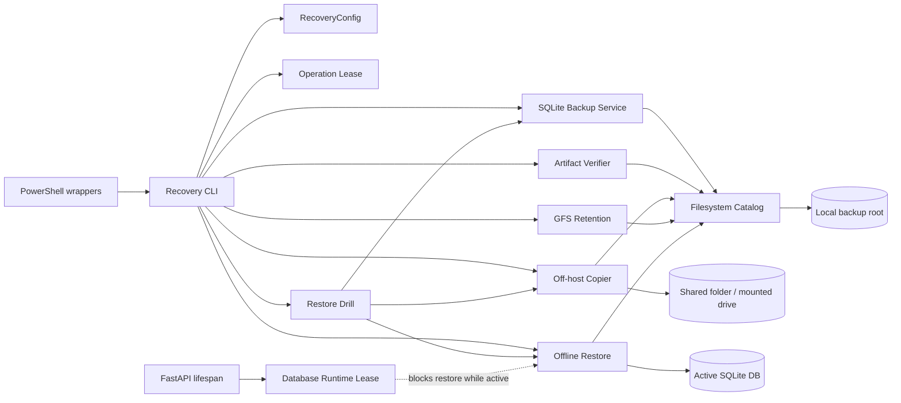
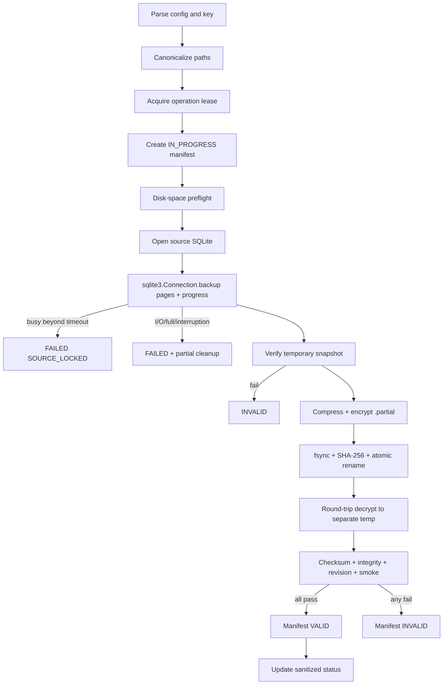
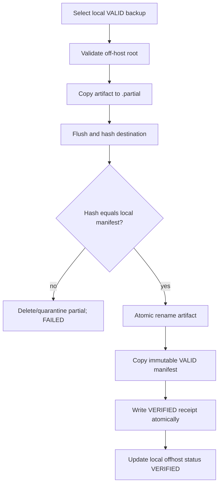
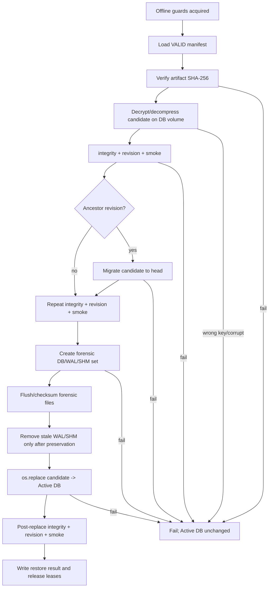

# Design Document: SQLite Backup, Restore, and Recovery Readiness

## Overview

Milestone 10.7 menambahkan recovery subsystem operator-side untuk SQLite tanpa mengubah domain trading. Subsystem memakai SQLite Online Backup API untuk membuat consistent snapshot ketika WAL/writer aktif, memverifikasi snapshot, mengompresi dan mengenkripsinya dengan authenticated encryption, menyimpan manifest durable, melakukan copy off-host dengan checksum, menerapkan GFS retention, dan melakukan offline restore melalui candidate validation serta atomic replace.

Desain tetap native: Python virtual environment sebagai implementation source of truth, wrapper Windows PowerShell 5.1 untuk operator/Task Scheduler, filesystem lokal dan mounted/shared folder sebagai storage, serta Alembic existing untuk compatibility. Tidak ada container, cloud SDK, queue, public backup endpoint, scheduled restore, MT5 call, atau deployment VPS.

### Design Goals

- Backup aktif selalu memakai SQLite Online Backup API; raw copy hanya diperbolehkan sebagai forensic evidence setelah backend berhenti.
- Backup baru dianggap `VALID` setelah artifact round-trip, SHA-256, AES-GCM authentication, `PRAGMA integrity_check`, Alembic lineage, dan repository smoke check lulus.
- Restore tidak dapat berjalan selama backend memegang runtime database lease.
- Active Database tidak disentuh sampai candidate selesai didekripsi, diverifikasi, dimigrasikan bila compatible, dan diuji.
- Metadata/status tahan restart, dapat dibangun ulang dari manifest, dan tidak menyimpan key atau credential-bearing URL.
- Seluruh workflow dapat diuji pada file-backed temporary SQLite tanpa memakai production database atau MT5.

### Findings yang Mendasari Desain

1. Engine global dan engine backtest kedua dapat hidup bersamaan; dispose satu engine tidak cukup membuktikan semua writer berhenti. Backend lifecycle memerlukan runtime lease lintas-proses yang juga diperiksa restore.
2. Alembic `env.py` sudah menerima `-x database_url=...`, sehingga candidate migration dapat diarahkan ke temporary SQLite tanpa menyentuh Active Database.
3. Existing dependency tidak menyediakan authenticated encryption. Implementasi akan menambah `cryptography` dengan exact pin yang diverifikasi terhadap Python 3.10+ dan Windows wheel saat implementation.
4. Metadata tidak boleh disimpan hanya di Active Database karena metadata harus tetap tersedia ketika database rusak atau sedang direstore.
5. Nginx scripts menetapkan pola PowerShell `[CmdletBinding()]`, `$ErrorActionPreference = 'Stop'`, literal path, dan explicit exit-code check; wrapper baru mengikuti pola tersebut.
6. Public health saat ini bukan authoritative readiness. Backup status disediakan melalui operator CLI/durable status file; tidak ada API baru pada milestone ini.

## Architecture



### Proposed File Layout

```text
backend/app/recovery/
├── __init__.py
├── cli.py                 # argparse entry point and exit-code mapping
├── config.py              # validated recovery policy derived from Settings
├── types.py               # enums and frozen dataclasses
├── paths.py               # SQLite URL/path canonicalization and containment
├── leases.py              # operation lease and backend runtime lease
├── catalog.py             # atomic manifest/status/receipt persistence
├── sqlite_backup.py       # Online Backup API adapter
├── artifact.py            # gzip + AES-256-GCM format and streaming I/O
├── verification.py        # checksum, integrity, revision, smoke checks
├── alembic_compat.py      # lineage and candidate migration
├── offhost.py             # verified partial-copy/rename workflow
├── retention.py           # GFS planning and deletion
├── restore.py             # offline restore and forensic preservation
├── drill.py               # isolated end-to-end restore drill
├── status.py              # sanitized durable recovery status
└── logging.py             # allowlisted JSONL events and redaction

scripts/
├── Backup-Database.ps1
├── Verify-Backup.ps1
├── Restore-Database.ps1
├── Copy-BackupOffHost.ps1
├── Invoke-RestoreDrill.ps1
├── Invoke-BackupRetention.ps1
└── Get-BackupStatus.ps1

docs/deployment/
└── windows-sqlite-recovery.md
```

`backend/app/main.py` hanya memperoleh/release `DatabaseRuntimeLease` pada lifespan. Recovery modules tidak mengimpor `app.main`, route API, MT5, strategy, risk, paper, backtest, demo, atau executor. Tidak ada migration baru karena catalog berada di luar Active Database.

## Components and Interfaces

### `RecoveryConfig`

Immutable configuration yang dibentuk dari `Settings` dan explicit CLI overrides. Validation terjadi sebelum I/O.

```text
RecoveryConfig
- source_database: Path
- local_root: Path
- offhost_root: Path | None
- rpo: timedelta = 24h
- rto: timedelta = 2h
- interval: timedelta = 24h
- daily_retention: int = 7
- weekly_retention: int = 4
- monthly_retention: int = 3
- busy_timeout: timedelta
- operation_timeout: timedelta
- compression: NONE | GZIP
- encryption_required: bool = true
- encryption_key_env: str = BACKUP_ENCRYPTION_KEY
- application_version: str
- alembic_config: Path
```

Environment names yang ditambahkan ke `.env.example`:

```text
BACKUP_RPO_HOURS=24
BACKUP_RTO_HOURS=2
BACKUP_INTERVAL_HOURS=24
BACKUP_RETENTION_DAILY=7
BACKUP_RETENTION_WEEKLY=4
BACKUP_RETENTION_MONTHLY=3
BACKUP_LOCAL_DIRECTORY=<operator-configured-local-path>
BACKUP_OFFHOST_DIRECTORY=<operator-configured-shared-or-mounted-path>
BACKUP_ENCRYPTION_REQUIRED=true
BACKUP_ENCRYPTION_KEY=<not provided in repository>
BACKUP_COMPRESSION=gzip
BACKUP_BUSY_TIMEOUT_SECONDS=30
BACKUP_OPERATION_TIMEOUT_SECONDS=3600
```

`.env.example` hanya memuat placeholder kosong untuk key dan destination; tidak ada default key. Scheduled staging backup gagal tertutup sampai destination dan key dikonfigurasi. CLI override tidak menerima key sebagai argument.

### `SQLitePathResolver`

Memakai `sqlalchemy.engine.make_url` untuk memastikan URL adalah SQLite file-backed. Relative database path diselesaikan terhadap working directory project yang ditetapkan script. Resolver menolak `:memory:`, query yang tidak didukung, source/destination alias, traversal, reparse-point escape, backup root di dalam source file path, serta off-host root yang canonical-nya sama dengan local root.

Hanya basename tersanitasi—misalnya `trading_bot.db`—disimpan sebagai `source_database` pada manifest/status. Canonical path hanya hidup di process memory dan structured local debug event yang tetap direduksi menjadi path role, bukan raw value.

### `OperationLease`

Satu recovery operation lease pada `<local_root>/.locks/recovery.lock` menserialkan backup, restore, verification mutation, off-host publication, dan retention deletion. Lock record menyimpan operation ID, PID, hostname hash, dan start UTC tanpa secret. File descriptor lock menggunakan:

- Windows: `msvcrt.locking` non-blocking.
- Test/non-Windows: `fcntl.flock` non-blocking.

Stale file content tidak memberi ownership; kernel lock adalah authority. Takeover hanya terjadi ketika kernel lock bebas. Semua operation memiliki bounded timeout dan release pada `finally`/process exit.

### `DatabaseRuntimeLease`

FastAPI lifespan memperoleh exclusive lock pada `<database>.runtime.lock` sebelum membuat service yang dapat menulis dan menahannya sampai shutdown selesai. Restore mencoba lock yang sama dan gagal bila backend aktif. In-memory database pada unit test existing dapat melewati lease; file-backed application harus memakainya.

Restore juga menjalankan SQLite `BEGIN EXCLUSIVE` preflight setelah runtime lease diperoleh. Kombinasi lease dan exclusive database preflight menangkap backend current-version, external SQLite writer, dan handle/lock yang belum selesai. Restore memegang runtime lease sampai post-replace verification selesai. Backup tidak mengambil runtime lease karena Online Backup API memang mendukung writer aktif.

### `FilesystemCatalog`

Catalog memakai atomic JSON sidecar, bukan tabel SQLite:

```text
<local_root>/
├── backups/<backup_id>/
│   ├── artifact.btbak
│   ├── manifest.json
│   └── offhost-receipt.json     # setelah copy terverifikasi
├── forensic/<restore_id>/...
├── operations/YYYY-MM-DD.jsonl
├── status.json
├── .work/
└── .locks/
```

Setiap backup selalu memiliki managed directory sendiri dan file bernama tepat `manifest.json`; tidak ada backup valid yang hanya bergantung pada catalog global. `manifest.json` memuat application version, migration revision, backup timestamps, checksum SHA-256, encryption/compression status, backup format version, lifecycle/verification status, serta metadata wajib lain. Write dilakukan ke sibling `.partial`, di-flush, `fsync`, lalu `os.replace`. `status.json` adalah cache sanitized; source of truth tetap setiap `manifest.json`/receipt dan dapat direbuild. Catalog hanya membaca managed directory + schema/magic yang dikenal. Unknown files tidak pernah dihapus retention.

## Data Models

### Backup Manifest

```text
BackupManifest (schema_version=1)
- backup_format_version: int = 1
- backup_id: UUID
- application_version: str
- database_revision: str
- created_at: datetime UTC
- completed_at: datetime UTC | null
- source_database: sanitized basename
- backup_filename: managed basename
- backup_size: int | null
- checksum_sha256: lowercase hex | null
- encrypted: bool
- encryption: AES_256_GCM | NONE
- key_id: non-secret str | null
- compression: GZIP | NONE
- rpo_class: tuple[DAILY | WEEKLY | MONTHLY, ...]
- status: IN_PROGRESS | VALIDATING | VALID | INVALID | FAILED
- failure_reason: stable code | null
- verification:
    checksum: PASS | FAIL | NOT_RUN
    authentication: PASS | FAIL | NOT_RUN
    integrity_check: PASS | FAIL | NOT_RUN
    alembic: PASS | FAIL | NOT_RUN
    repository_smoke: PASS | FAIL | NOT_RUN
    verified_at: datetime UTC | null
- offhost:
    status: NOT_ATTEMPTED | COPYING | VERIFIED | FAILED
    verified_at: datetime UTC | null
- metrics:
    source_logical_bytes: int | null
    artifact_bytes: int | null
    backup_seconds: decimal string | null
    verification_seconds: decimal string | null
```

`failure_reason` adalah enum allowlist seperti `SOURCE_LOCKED`, `DISK_SPACE`, `INTERRUPTED`, `CHECKSUM_MISMATCH`, `AUTHENTICATION_FAILED`, `INTEGRITY_FAILED`, `REVISION_INCOMPATIBLE`, `OFFHOST_UNAVAILABLE`, atau `INTERNAL_FAILURE`. Raw exception hanya dikonversi ke category; traceback tidak masuk manifest.

### Off-host Receipt

```text
OffHostReceipt
- schema_version: 1
- backup_id: UUID
- copied_at: datetime UTC
- source_checksum_sha256: str
- destination_checksum_sha256: str
- artifact_size: int
- status: VERIFIED | FAILED
- failure_reason: stable code | null
```

Destination menyimpan artifact, immutable valid manifest, lalu receipt terakhir. Local catalog baru mengubah off-host status menjadi `VERIFIED` setelah destination hash cocok dan receipt berhasil dipublikasi.

### Restore Result

```text
RestoreResult
- restore_id: UUID
- backup_id: UUID
- started_at/completed_at: datetime UTC
- status: VALIDATED | RESTORED | FAILED
- dry_run: bool
- checksum_result: PASS | FAIL
- authentication_result: PASS | FAIL
- integrity_result: PASS | FAIL
- source_revision/target_revision: str
- migration_result: NOT_REQUIRED | PASS | FAIL
- repository_smoke_result: PASS | FAIL
- forensic_copy_id: UUID | null
- atomic_replace_result: NOT_RUN | PASS | FAIL
- elapsed_seconds: decimal string
- rto_target_seconds: int
- rto_met: bool
- failure_reason: stable code | null
```

### Recovery Status

Status CLI hanya mengeluarkan:

```text
RecoveryStatus
- last_successful_backup_at
- last_verified_backup_at
- backup_age_seconds
- rpo_target_seconds / rpo_met
- offhost_status / last_offhost_verified_at
- next_scheduled_backup_at
- latest_restore_drill_at / status
- latest_restore_seconds / rto_target_seconds / rto_met
- latest_failure_category
```

Tidak ada key, raw path, database URL, username, hostname mentah, atau credential.

## Artifact Format and Encryption

### Versioned `.btbak` Container

Artifact final mempunyai format binary versioned:

```text
MAGIC | FORMAT_VERSION | HEADER_LENGTH | CANONICAL_JSON_HEADER | CIPHERTEXT | GCM_TAG
```

Header memuat `backup_id`, `created_at`, `application_version`, `database_revision`, `compression`, `encryption`, random 96-bit nonce, dan plaintext logical size. Header tidak memuat source path atau key. Magic, version, header length, dan canonical header menjadi AES-GCM Additional Authenticated Data sehingga perubahan metadata kritis menyebabkan authentication failure.

Key adalah tepat 32 random bytes yang diberikan sebagai base64 melalui environment atau secure prompt. Tidak ada KDF/default passphrase pada v1; ini menghindari parameter lemah dan ambiguity. Optional `BACKUP_ENCRYPTION_KEY_ID` adalah label non-secret untuk membantu operator memilih key, tetapi tidak digunakan sebagai key.

Pipeline artifact:

```text
verified temporary SQLite snapshot
  -> streaming gzip (level fixed/documented)
  -> streaming AES-256-GCM
  -> .btbak.partial
  -> fsync
  -> SHA-256 over complete container
  -> atomic rename to .btbak
  -> decrypt/decompress round-trip verification
  -> manifest VALID
```

Implementasi menggunakan low-level streaming `Cipher(AES(key), GCM(nonce))` dari package `cryptography`, bukan non-streaming helper yang memuat seluruh database ke memory. Exact dependency version dipilih dan dipin saat implementation setelah wheel/Python compatibility diverifikasi. Package resmi mendukung primitive symmetric cryptography dan Python 3.9+, sehingga sesuai baseline Python 3.10+ repository ([PyPI cryptography](https://pypi.python.org/pypi/cryptography/)). Content was rephrased for compliance with licensing restrictions.

Online Backup API tetap memerlukan temporary plaintext SQLite snapshot. Snapshot ditempatkan di `<local_root>/.work/<operation_id>/snapshot.db`, dibuat dengan restrictive ACL inheritance, tidak pernah memakai final filename, dan dihapus dalam `finally`. Dokumentasi menyatakan overwrite/delete tidak menjamin secure erasure pada SSD; encrypted volume dan ACL adalah defense utama.

SHA-256 meng-cover seluruh byte `.btbak`. Restore memeriksa checksum sebelum decrypt, lalu memeriksa GCM tag dan header/manifest identity. Dengan demikian corruption terdeteksi cepat dan tampering kritis tetap ditolak oleh authenticated encryption.

## Backup Flow



### SQLite Online Backup Adapter

Source dibuka melalui stdlib `sqlite3` pada canonical file path. Destination adalah fresh temporary SQLite file. Adapter memanggil `source.backup(destination, pages=<bounded chunk>, progress=..., sleep=...)`. Progress callback:

- memeriksa elapsed operation timeout;
- memeriksa injected cancellation/interruption token;
- mencatat progress tanpa path/secret;
- memungkinkan writer berjalan di antara page batches.

SQLite backup semantics mengambil consistent transaction snapshots dan menyertakan committed WAL state. Desain tidak melakukan raw copy WAL/SHM dan tidak memaksa checkpoint pada live database, sehingga writer tidak diberi checkpoint side effect. Busy timeout menangani lock sementara; exclusive lock yang bertahan melampaui policy menghasilkan `SOURCE_LOCKED`.

Disk preflight membandingkan free space terhadap `max(source_db + wal_size, page_count * page_size)` dikali safety factor untuk snapshot, encrypted artifact, dan round-trip verification. Preflight bukan jaminan; semua write tetap menangani `ENOSPC`/Windows disk-full dan tidak menerbitkan final artifact. Filesystem adapter dapat diinjeksi test untuk mid-operation disk-full/interruption.

## Verification Pipeline

`BackupVerifier.verify(backup_id, key_source)` menjalankan:

1. Load dan schema-validate manifest.
2. Canonicalize managed artifact path.
3. Bandingkan actual size dan SHA-256 dengan manifest.
4. Parse magic/version/header; cocokkan backup ID, timestamps, revision, compression, dan encryption dengan manifest.
5. Authenticate/decrypt/decompress ke isolated temporary SQLite.
6. Buka `file:<path>?mode=ro&immutable=1` untuk pemeriksaan non-migration.
7. Jalankan `PRAGMA integrity_check`; terima hanya satu row `ok`.
8. Baca single Alembic revision.
9. Validasi revision terhadap `ScriptDirectory` lineage.
10. Jalankan read-only schema/repository smoke checks.
11. Hapus temporary plaintext dan atomically update manifest/status.

Verification ulang bersifat idempotent. Verifier tidak pernah membuka Active Database dan tidak mengubah backup payload. `quick_check` boleh dipakai untuk diagnostic awal tetapi tidak menggantikan full `integrity_check`.

### Alembic Compatibility

`AlembicCompatibilityService` menggunakan Alembic `ScriptDirectory` untuk menentukan head dan lineage:

- `backup_revision == head`: compatible tanpa migration.
- backup revision ancestor tunggal dari head: compatible for candidate migration.
- missing, unknown, divergent branch, atau newer/not ancestor: reject.

Untuk restore ancestor, candidate temporary database dimigrasikan melalui Alembic existing dengan explicit `-x database_url=sqlite+aiosqlite:///...`. Path candidate tidak dicetak pada log. Migration hanya menyentuh candidate; setelah upgrade dilakukan integrity + revision + smoke verification ulang. Automatic downgrade tidak tersedia.

### Repository Smoke Check

Smoke checker tidak mengimpor `app.main`. Ia memeriksa secara read-only:

- `alembic_version` tepat satu revision;
- allowlisted critical tables dari SQLAlchemy metadata tersedia;
- query/count sederhana pada auth, signal/trade-plan, safety/demo audit, paper, dan backtest tables yang ada;
- SQLite foreign-key check untuk database candidate;
- optional deterministic fingerprint yang diberikan drill.

Smoke checker tidak memanggil service domain, background engine, connector, atau repository mutation.

## Off-host Copy Flow



Copy menggunakan bounded buffered streaming, tidak shell `Copy-Item` untuk domain logic, sehingga checksum dan interruption dapat diuji. Wrapper PowerShell hanya memanggil Python CLI. Retry memakai backup ID dan destination managed filename yang sama; existing completed artifact diterima hanya jika size/hash sama, selain itu fail closed. Local backup tetap `VALID` ketika off-host gagal, tetapi recovery status menunjukkan `OFFHOST_FAILED`.

## GFS Retention

Retention planner membaca hanya manifest valid. Backup diurutkan descending menurut `completed_at`, lalu memilih newest backup untuk:

- setiap UTC calendar day, maksimum N daily bucket;
- setiap ISO UTC week, maksimum N weekly bucket;
- setiap UTC year-month, maksimum N monthly bucket.

Keep-set adalah union seluruh bucket ditambah:

- backup VALID terbaru;
- Restore Lease aktif;
- in-progress/validating/invalid yang belum selesai investigation policy;
- backup yang belum memenuhi required off-host verification;
- artifact yang sedang dicopy/verify.

`rpo_class` manifest diperbarui menjadi ordered list class yang dipenuhi. Dry-run menghasilkan deterministic plan. Execution melakukan re-read manifest dan lock check tepat sebelum delete, memindahkan managed files ke catalog trash transaction directory, lalu menghapus setelah metadata commit. Crash recovery dapat menyelesaikan atau mengembalikan transaction. Unknown file, symlink, reparse-point escape, dan manifest malformed selalu dilewati.

## Safe Restore Design

### Preconditions

Restore adalah manual/offline. Urutan guard:

1. Parse config/key dan acquire global operation lease.
2. Acquire `DatabaseRuntimeLease`; failure berarti backend aktif dan restore ditolak.
3. Open Active Database dengan short timeout dan obtain/release `BEGIN EXCLUSIVE`; failure berarti writer/handle aktif.
4. Create Restore Lease pada selected backup agar retention/copy tidak mengubahnya.
5. Validate disk capacity untuk candidate + forensic set + temporary plaintext.

Dry-run menjalankan langkah 1–5 dan seluruh candidate verification: manifest/artifact identity, SHA-256 checksum, AES-GCM decrypt/authentication, decompression, `PRAGMA integrity_check`, Alembic lineage/migration compatibility, serta repository smoke check. Dry-run berhenti sebelum Forensic Copy, WAL/SHM cleanup, `os.replace`, dan post-replace mutation; Active Database harus byte-identical sebelum/sesudah.

### Candidate and Replacement Flow



Candidate dibuat sebagai sibling tersembunyi Active Database agar final `os.replace` berada pada volume/filesystem yang sama. Artifact tidak pernah didecrypt langsung ke Active Database path. Existing Active Database tetap ada sampai atomic replace.

### Forensic Preservation

Setelah backend berhenti dan candidate valid, restore membuat:

```text
forensic/<restore_id>/
├── active.db
├── active.db-wal       # bila ada
├── active.db-shm       # bila ada
└── forensic-manifest.json
```

Setiap file dicopy dengan bounded streaming, flush, size, dan SHA-256. Manifest diberi label `FORENSIC_NOT_VERIFIED_BACKUP`. Ini adalah evidence exact-state, bukan recovery point konsisten. Restore berhenti bila forensic copy gagal, kecuali explicit first-restore mode ketika Active Database memang tidak ada.

`os.replace(candidate, active)` adalah satu-satunya publication path. Tidak ada fallback delete-then-copy. Open Windows handle membuat replace gagal dan Active Database lama tetap ada. Setelah replace, stale WAL/SHM lama sudah berada di forensic set dan tidak dipasangkan dengan database baru.

Post-replace failure tidak menyalakan backend. Result memberi operator langkah rollback menggunakan forensic set; automatic rollback dihindari agar tidak menimpa evidence ketika penyebab failure belum dipahami.

## Restore Drill Design

`RestoreDrillRunner` membuat workspace random di test/temp root, destination lokal, dan simulated off-host directory. Ia menggunakan key random per drill yang hanya berada di memory/environment child process.

Tahapan:

1. Buat SQLite test database dengan Alembic head.
2. Seed data representatif dan simpan count + canonical row fingerprints.
3. Jalankan production `BackupService` dan catat duration.
4. Jalankan artifact verification.
5. Jalankan production `OffHostCopyService` ke simulated destination.
6. Hapus/korup source test database.
7. Jalankan production `RestoreService` terhadap target test.
8. Jalankan integrity, revision, foreign-key, dan repository smoke checks.
9. Bandingkan fingerprints sebelum/sesudah.
10. Catat restore duration, target RTO, actual RTO, RPO age, target RPO, dan pass/fail.
11. Scan log/manifest/output untuk drill key dan secret markers.
12. Assert MT5/order guard counters tetap nol.

Drill tidak mengimpor `app.main`; test monkeypatch membuat import/call ke MT5/executor gagal bila dependency boundary dilanggar. Workspace dibersihkan setelah summary/diagnostic yang aman tersimpan. Opsi `-KeepFailedWorkspace` hanya tersedia manual dan menampilkan opaque workspace ID, bukan key.

## CLI Contract

```text
python -m app.recovery.cli backup
python -m app.recovery.cli verify --backup-id <uuid>
python -m app.recovery.cli copy-offhost --backup-id <uuid>
python -m app.recovery.cli retention [--dry-run]
python -m app.recovery.cli restore --backup-id <uuid> [--dry-run]
python -m app.recovery.cli drill
python -m app.recovery.cli status
```

Key dibaca dari `BACKUP_ENCRYPTION_KEY` atau secure `getpass` untuk interactive restore; tidak ada `--key`. CLI menghasilkan satu JSON summary di stdout dan structured JSONL event ke restricted local catalog. Human-readable wrapper output dibentuk dari allowlisted summary.

### Stable Exit Codes

| Code | Meaning                                 |
| ---: | --------------------------------------- |
|    0 | Success                                 |
|    2 | Configuration/input invalid             |
|    3 | Operation/runtime lease unavailable     |
|    4 | Source lock or backend active           |
|    5 | Disk/filesystem failure                 |
|    6 | Checksum/artifact format failure        |
|    7 | Encryption authentication/key failure   |
|    8 | SQLite integrity failure                |
|    9 | Alembic compatibility/migration failure |
|   10 | Off-host copy/verification failure      |
|   11 | Retention safety failure                |
|   12 | Restore/drill verification failure      |
|    1 | Sanitized unexpected internal failure   |

Raw exception tidak dicetak. Debug traceback hanya boleh ditulis pada local restricted diagnostic log dan tetap melewati redactor; default selalu off.

## PowerShell Wrapper Design

Semua script:

- menggunakan `[CmdletBinding()]`, typed parameters, dan `$ErrorActionPreference='Stop'`;
- menemukan project root dan `backend\.venv\Scripts\python.exe` tanpa bergantung pada caller CWD;
- tidak menerima encryption key sebagai parameter;
- memanggil CLI dengan argument array, bukan string interpolation/shell eval;
- mengembalikan `$LASTEXITCODE` secara benar;
- tidak start/stop backend, Nginx, MT5, atau service manager;
- mendukung `-DryRun` pada retention/restore;
- menulis structured summary tanpa raw path/key.

`Get-BackupStatus.ps1` adalah wrapper read-only tambahan agar operator tidak perlu mengetahui Python module path. Required six scripts tetap tersedia dengan nama tepat sesuai requirement.

## Monitoring and Scheduling

`StatusService` merebuild state dari manifest/receipt/drill result dan menulis sanitized `status.json` atomically. RPO age dihitung dari `verified_at` backup VALID terbaru. `next_scheduled_backup_at = last scheduled slot + interval`; bila belum ada backup, status `DUE_NOW`. RTO actual berasal dari latest successful drill completion window, bukan hanya file-copy duration.

Tidak ada route FastAPI baru. Status tersedia melalui CLI/PowerShell dan dapat dibaca external watchdog sebagai JSON. Public `/health` dan Nginx `/healthz` tidak diubah atau dianggap bukti backup readiness.

Runbook Task Scheduler membuat task terpisah:

1. Daily backup.
2. Verify latest backup.
3. Copy latest VALID backup off-host.
4. Retention setelah off-host verification.
5. Periodic restore drill pada isolated workspace.

Tasks memakai dedicated least-privilege account, `Do not start a new instance`, explicit timeout, project-root working directory, dan failure action berdasarkan non-zero exit code. Restore normal tidak pernah dijadwalkan. Alerting tetap vendor-neutral: Task Scheduler Operational log/Event Log trigger atau external watchdog membaca status JSON dan exit code.

## Error Handling

| Failure                             | Required outcome                                                    |
| ----------------------------------- | ------------------------------------------------------------------- |
| Source database missing/unsupported | Fail before manifest publication                                    |
| Temporary source lock               | Bounded retry; no unbounded hang                                    |
| Persistent/exclusive lock           | `FAILED/SOURCE_LOCKED`; no valid artifact                           |
| Writer active during normal backup  | Online backup continues to consistent transaction boundary          |
| Disk full before/mid-write          | Partial never renamed; cleanup/quarantine; non-zero exit            |
| Process interruption                | IN_PROGRESS remains recoverable; next run reconciles partial safely |
| Wrong key/tampered ciphertext       | GCM authentication fails; target unchanged                          |
| Checksum mismatch                   | Reject before decrypt/restore                                       |
| Integrity failure                   | Mark INVALID; never normal restore                                  |
| Revision incompatibility            | Reject candidate; Active Database unchanged                         |
| Off-host unavailable/mismatch       | Local remains VALID; off-host remains FAILED                        |
| Retention race/lease                | Candidate rechecked and skipped                                     |
| Backend active during restore       | Runtime lease unavailable; reject                                   |
| Atomic replace failure              | Old Active Database remains; candidate retained safely              |
| Post-replace verification failure   | Backend remains stopped; operator rollback procedure required       |

Startup reconciliation scans only managed `.partial`/operation records. It never guesses ownership from extension alone and never deletes unknown files. Incomplete manifests become `FAILED/INTERRUPTED` after operation lease confirms no active owner.

## Security Design

### Secret Handling

- Key source is environment or `getpass`; never CLI argument.
- Config/manifest/log dataclasses use explicit serialization allowlists.
- Redactor tests generated exception strings containing key, password, token, UNC credential, database URL, and environment markers.
- Process invocation does not echo environment.
- Key bytes are held in mutable buffer where practical and references are released after use; Python cannot guarantee zeroization, which is documented.
- Off-host credential provisioning is delegated to Windows account/mounted-share authentication, not stored in scripts.

### Filesystem Safety

- All managed paths are canonicalized before access.
- `Path.is_relative_to` equivalent compatible with Python baseline enforces containment.
- Existing destination uses `lstat`; symlink/reparse-point files are rejected.
- Creation uses exclusive mode and inherits preconfigured restricted ACL.
- Runbook applies NTFS ACL to local/off-host/work/forensic/log directories and recommends encrypted volume.
- Retention and cleanup operate from catalog identity + expected magic, not glob alone.

### API and Domain Isolation

There is no backup/restore route, browser UI, WebSocket topic, or static-file exposure. Nginx config does not serve backup roots. Recovery package dependency tests reject imports from MT5, demo, strategy, risk, paper, backtest, market data, API routes, or `app.main`. Main only imports the small runtime lease primitive.

## Correctness Properties

### Property 1: Online backup consistency

For any sequence of committed writer transactions interleaved with page-batched online backup, the resulting snapshot is a valid SQLite transaction state, passes integrity check, and contains no partial transaction.

**Validates: Requirements 3.1, 3.2, 3.3, 3.4**

### Property 2: No failed operation publishes a valid artifact

For every injected lock, disk, interruption, compression, encryption, fsync, rename, or verification failure, no final artifact/manifest pair is marked `VALID`.

**Validates: Requirements 3.5, 3.6, 3.7, 3.8, 3.9, 3.10, 4.8, 4.9, 4.10**

### Property 3: Authenticated encryption is non-deterministic and tamper-evident

For any snapshot and two fresh nonces under the same key, ciphertext differs; any wrong key or one-byte header/ciphertext/tag mutation fails authentication and leaves the restore target unchanged.

**Validates: Requirements 5.1, 5.5, 5.7, 5.8**

### Property 4: Verification is necessary and sufficient for VALID transition

A manifest reaches `VALID` exactly when final checksum, authenticated decode, integrity check, allowed Alembic lineage, and repository smoke check all pass.

**Validates: Requirements 4.8, 6.1, 6.2, 6.3, 6.4, 6.5, 6.6, 6.7, 6.8**

### Property 5: Off-host verification is checksum-preserving

For every local VALID artifact, off-host status becomes VERIFIED only when destination bytes hash to the source checksum; every failed/interrupted transfer remains non-verified and cannot replace local validity.

**Validates: Requirements 7.1, 7.2, 7.3, 7.4, 7.5, 7.6, 7.7**

### Property 6: GFS retention preserves all mandatory recovery points

For every generated UTC backup timeline and positive daily/weekly/monthly counts, deletion candidates exclude the union of selected class buckets, latest VALID backup, active leases, incomplete verification, active copy, and required-not-yet-offhost backups.

**Validates: Requirements 8.1, 8.2, 8.3, 8.4, 8.5, 8.6, 8.7, 8.8, 8.9**

### Property 7: Dry-run is mutation-free

For every catalog and restore candidate, dry-run produces the same validation/plan as execution up to the mutation boundary while leaving artifacts, manifests, forensic files, and Active Database byte-identical.

**Validates: Requirements 8.8, 12.7, 12.8**

### Property 8: Restore cannot overlap backend runtime

For every file-backed database, while the application holds `DatabaseRuntimeLease`, restore cannot acquire it and performs no decrypt-to-target, forensic publication, WAL cleanup, or replacement.

**Validates: Requirements 9.2, 9.3**

### Property 9: Candidate validation precedes replacement

For every corrupt, wrong-key, checksum-mismatch, integrity-failing, or revision-incompatible backup, Active Database and associated WAL/SHM remain unchanged.

**Validates: Requirements 9.5, 9.6, 9.7, 9.8, 16.18, 16.19**

### Property 10: Forensic preservation precedes atomic publication

For every successful restore over an existing database, checksummed forensic copies of all existing DB/WAL/SHM files are completed before the single atomic replacement operation.

**Validates: Requirements 9.9, 9.10, 9.11, 9.12, 9.13, 9.14**

### Property 11: Migration only touches temporary candidate

For every compatible ancestor backup, all migration writes occur on candidate; migration failure leaves Active Database unchanged, and success is followed by integrity/revision/smoke revalidation.

**Validates: Requirements 10.2, 10.3, 10.4, 10.5, 10.6**

### Property 12: RPO and RTO boundaries are exact

For every UTC now/verified timestamp pair, RPO is met iff age is not greater than target; for every monotonic restore duration, RTO is met iff duration is not greater than target.

**Validates: Requirements 2.6, 2.7, 2.8, 11.10, 11.11**

### Property 13: Status reconstruction is deterministic and sanitized

For every valid catalog state, rebuilding status yields identical values independent of manifest enumeration order and never includes fields outside the status allowlist.

**Validates: Requirements 14.1, 14.2, 14.3, 14.4, 14.5, 14.6, 14.7, 14.8**

### Property 14: Path containment holds for all managed mutations

For all generated absolute/relative/traversal/symlink/reparse paths, write/delete/replace occurs only for canonical managed paths inside configured roots and never for source aliases or unrelated files.

**Validates: Requirements 15.1, 15.2, 15.8, 15.9**

### Property 15: Logs and metadata are secret non-interfering

For every generated secret and exception containing that secret, serialized manifest, status, receipt, stdout, stderr, and JSONL events contain no exact or encoded secret value.

**Validates: Requirements 4.9, 5.3, 5.12, 12.10, 15.7**

### Property 16: Recovery has no trading capability

For every backup, verify, copy, retention, restore, drill, and status operation, no MT5, demo, strategy, risk, paper, backtest, or broker mutation dependency is imported or called.

**Validates: Requirements 1.2, 1.3, 1.4, 11.15, 16.26**

## Testing Strategy

Semua SQLite behavioral tests memakai `tmp_path` file-backed database. Test fixtures membuat key random, local root, off-host root, deterministic UTC clock, injectable monotonic clock, filesystem fault adapter, dan cancellation token. Tidak ada test yang membaca `.env` atau production database.

### Mandatory Scenario Mapping

|   # | Scenario               | Test approach                                  |
| --: | ---------------------- | ---------------------------------------------- |
|   1 | Normal backup          | Current-head file DB → VALID artifact          |
|   2 | WAL active             | Uncheckpointed committed WAL rows included     |
|   3 | Writer active          | Background transaction loop during page backup |
|   4 | Database locked        | Exclusive lock + bounded timeout → failure     |
|   5 | Disk full              | Preflight and injected mid-stream `ENOSPC`     |
|   6 | Interruption           | Inject cancellation; no final VALID artifact   |
|   7 | Valid checksum         | Recomputed SHA-256 equals manifest             |
|   8 | Checksum mismatch      | Mutate artifact; verification/restore reject   |
|   9 | Encrypt/decrypt        | Round-trip current-head database               |
|  10 | Wrong key              | GCM authentication failure; target unchanged   |
|  11 | Integrity failure      | Corrupt decrypted SQLite pages                 |
|  12 | Revision mismatch      | Missing/unknown/newer/divergent revisions      |
|  13 | Off-host success       | Partial → verified hash → atomic publication   |
|  14 | Off-host failure       | Unavailable/full/interrupted destination       |
|  15 | GFS retention          | Generated multi-day/week/month timeline        |
|  16 | Retention dry-run      | Byte-identical catalog before/after            |
|  17 | Restore success        | Candidate validate → forensic → replace        |
|  18 | Corrupt restore reject | Corrupt artifact leaves target unchanged       |
|  19 | Backend active reject  | Runtime lease held by simulated app            |
|  20 | Forensic copy          | Existing DB/WAL/SHM hash and label checked     |
|  21 | Atomic replace         | Success and injected sharing-violation failure |
|  22 | End-to-end drill       | Seed → backup → off-host → corrupt → restore   |
|  23 | RPO                    | Before/equal/after 24-hour boundary            |
|  24 | RTO                    | Injected monotonic before/equal/after target   |
|  25 | No secret logs         | Canary key and encoded variants scanned        |
|  26 | No MT5/order           | Dependency/import/call guards remain zero      |
|  27 | Regression             | Existing backend/frontend suites unchanged     |

### Additional Tests

- Artifact header truncation, unsupported version, nonce/tag corruption, and header-manifest mismatch.
- Concurrent operations, stale lock content, active kernel lock, and interrupted catalog writes.
- Path traversal, absolute escape, alias, symlink/reparse-point, malformed UUID, and unknown managed file.
- Restore ancestor migration success/failure on candidate.
- Foreign-key and allowlisted table smoke failures.
- Off-host idempotent retry and existing destination mismatch.
- Retention class overlap, latest-valid protection, active Restore Lease, and no-offhost protection.
- Structured log schema and bounded failure messages.
- PowerShell 5.1 syntax/contract, key absence from process args, dry-run propagation, and exact exit code.

Property-based tests carry an explicit warning when executed and remain bounded. Full regression excludes existing opt-in real MT5 tests exactly as current repository policy.

## Documentation Design

`docs/deployment/windows-sqlite-recovery.md` berisi:

1. RPO/RTO policy dan configuration reference.
2. Directory/NTFS ACL preparation.
3. Encryption key generation, secure storage, rotation, escrow, loss, dan secure input.
4. Daily backup dan verification.
5. Verified off-host copy.
6. GFS retention dan mandatory first dry-run.
7. Task Scheduler setup dan failure alerting.
8. Normal restore.
9. Database corruption recovery.
10. Disk-full recovery.
11. Off-host failure recovery.
12. Restore drill dan evidence collection.
13. Operator/reviewer sign-off template.

Runbook menonjolkan:

> Raw copy database aktif bukan backup valid. Hentikan writer sebelum forensic copy/restore, dan jangan menghapus atau menimpa database/WAL/SHM asli sebelum candidate tervalidasi.

README hanya mendapat ringkasan Milestone 10.7 dan link runbook; detail operasional tetap di dokumen recovery.

## Database and Deployment Impact

- Tidak ada tabel/migration baru.
- Active SQLite schema dan domain records tidak berubah.
- Backup catalog adalah filesystem sidecar.
- Backend lifecycle mendapat runtime lease, tetapi tidak auto-backup/restore dan tidak mengubah startup state demo/MT5.
- Scheduled Task didokumentasikan tetapi tidak dibuat/dideploy pada VPS.
- Nginx, frontend, Strategy, Risk, Paper, Backtest, Demo, Safety, dan MT5 tidak berubah.
- Exactly one Uvicorn worker tetap wajib.
- Encryption dependency dipin exact saat implementation; tidak ada open version range.

## Implementation Constraints and Decision Log

1. **Online Backup API over `VACUUM INTO`:** lebih langsung untuk page-batched backup, progress, busy handling, dan writer-active tests; tidak memerlukan raw copy/checkpoint.
2. **Filesystem manifests over backup table:** status tetap tersedia ketika Active Database rusak dan tidak ikut rollback saat restore.
3. **AES-256-GCM streaming over password-only encryption:** authenticated, bounded memory, wrong-key detection; v1 menerima random 32-byte key dan menghindari implicit weak KDF.
4. **No API:** mengurangi exfiltration/destructive surface; operator CLI dan Task Scheduler memenuhi kebutuhan.
5. **Runtime lease plus SQLite exclusive preflight:** satu indikator saja tidak cukup karena backend memiliki lebih dari satu engine dan external SQLite process mungkin ada.
6. **Same-volume atomic replace only:** restore tidak fallback ke non-atomic overwrite.
7. **Forensic exact-state copy plus validated backup:** keduanya berbeda tujuan dan tidak saling menggantikan.
8. **No automatic service restart:** restored database tetap offline sampai operator memverifikasi dan melakukan startup/reconciliation pada milestone operasional terpisah.
9. **No production database in drill:** semua evidence berasal dari isolated test database.
10. **No guaranteed SSD secure erase claim:** streaming/ACL/encrypted volume meminimalkan plaintext; cleanup bersifat best-effort dan transparan.
